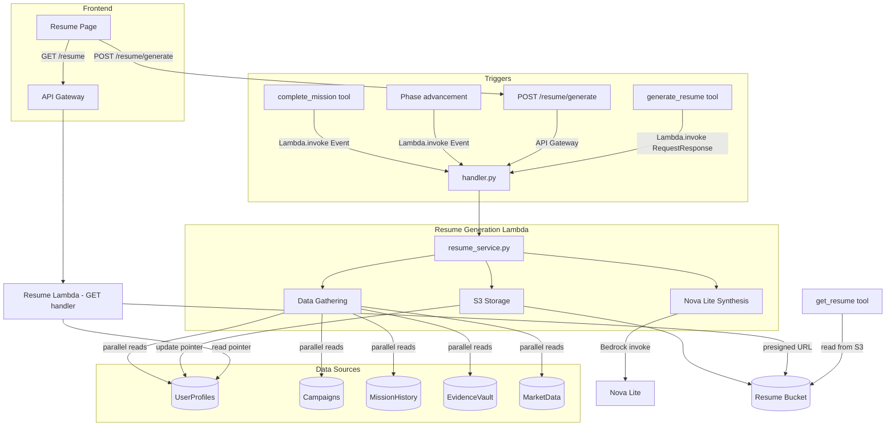

# Design Document: Agent-Friendly Resume

## Overview

The Agent-Friendly Resume feature adds an auto-generated, dual-audience resume to the REGAIN platform. Each resume is a markdown file with YAML frontmatter: the frontmatter provides structured data for AI recruiting agents to parse programmatically, while the markdown body delivers a professionally written narrative for human recruiters. The resume is synthesized by Nova Lite from real platform data — profile, campaign, missions, evidence, and market alignment — not from templates with string interpolation.

Resume generation is triggered asynchronously on two events: mission completion and phase advancement. Users can also trigger on-demand generation via the coaching agent or a dedicated frontend page. The generated document is stored in S3 with both a versioned `latest.md` and timestamped historical copies.

### Key Design Decisions

1. **Single Resume Lambda** — One Lambda function handles all resume generation (triggered by async invocation, API Gateway, or coaching agent tools). This avoids duplicating the data-gathering and LLM-synthesis logic across multiple functions.

2. **Async invocation via Lambda.invoke(InvocationType='Event')** — The `complete_mission` and phase advancement code paths invoke the Resume Lambda asynchronously using the Lambda SDK's fire-and-forget invocation. This keeps mission completion non-blocking without introducing SQS or EventBridge complexity.

3. **Dedicated S3 prefix on existing bucket** — Rather than creating a new bucket, the resume documents use a `resumes/{userId}/` prefix on a new dedicated Resume bucket. This keeps IAM scoping clean and avoids cross-purpose bucket policies.

4. **DynamoDB metadata pointer** — Only a pointer (`resumeS3Key`, `resumeVersion`, `lastResumeGeneratedAt`) is stored in UserProfiles. The actual document lives in S3.

5. **Rate limiting in Lambda** — The 3-per-day manual generation limit is enforced in the Resume Lambda handler by querying the `lastResumeGeneratedAt` and a `dailyResumeCount` counter on the UserProfiles item, rather than using API Gateway usage plans.

## Architecture



### Request Flow

1. **Async trigger (mission/phase)**: Existing code calls `lambda_client.invoke(FunctionName=resume_lambda_arn, InvocationType='Event', Payload=...)`. The Resume Lambda gathers data, calls Nova Lite, stores to S3, updates UserProfiles. No response needed.

2. **On-demand via API**: `POST /resume/generate` hits the Resume Lambda synchronously. Handler checks rate limit, runs generation, returns resume content + metadata. `GET /resume` reads the pointer from UserProfiles, fetches from S3, generates a presigned URL.

3. **Coaching agent tools**: `generate_resume` invokes the Resume Lambda synchronously (RequestResponse) and returns the presigned URL. `get_resume` reads UserProfiles pointer and fetches directly from S3.

## Components and Interfaces

### Backend Components

#### 1. Resume Generation Lambda (`backend/handlers/resume/`)


- `handler.py` — Thin Lambda handler. Routes based on invocation source (API Gateway GET/POST vs async event). Validates input, delegates to service, returns response.
- `service.py` — `ResumeService` class containing all business logic: data gathering, LLM prompt construction, S3 storage, metadata updates.

```python
# handler.py — routes by event shape
def lambda_handler(event: dict, context: Any) -> dict:
    """Route to GET (fetch), POST (generate with rate limit), or async (generate)."""

# service.py — business logic
class ResumeService:
    def __init__(self, db: DynamoDBClient, s3_client, bedrock_client): ...
    def generate_resume(self, user_id: str) -> ResumeResult: ...
    def get_resume(self, user_id: str) -> ResumeMetadata: ...
    def _gather_data(self, user_id: str) -> ResumeData: ...
    def _synthesize(self, data: ResumeData) -> str: ...
    def _store(self, user_id: str, content: str) -> StorageResult: ...
```

#### 2. Coaching Agent Resume Tools (`backend/agents/coaching/tools.py`)

Two new `@tool` functions added to the existing tools module:

```python
@tool
def generate_resume(user_id: str) -> dict[str, Any]:
    """Invoke resume generation and return the presigned URL, version, and timestamp."""

@tool
def get_resume(user_id: str) -> dict[str, Any]:
    """Retrieve the latest resume content and metadata without regenerating."""
```

These tools invoke the Resume Lambda (or read S3 directly for `get_resume`) using boto3, following the same pattern as existing tools like `get_alignment`.

#### 3. Async Trigger Integration

In `complete_mission` (tools.py) and the phase advancement path (engine/lifecycle.py), add a fire-and-forget Lambda invocation after the primary operation succeeds:

```python
# Added at end of complete_mission, after successful completion
lambda_client.invoke(
    FunctionName=os.environ["RESUME_LAMBDA_ARN"],
    InvocationType="Event",
    Payload=json.dumps({"user_id": user_id, "trigger": "mission_completion"}),
)
```

Wrapped in try/except so failures are logged but never block the primary operation.

### Frontend Components

#### 4. Resume Page (`frontend/src/pages/ResumePage.tsx`)

New page component with:
- Structured metadata display (parsed from frontmatter fields returned by API)
- Markdown body rendered using the existing `MarkdownMessage` component
- "Download .md" button (uses presigned URL)
- "Regenerate" button (calls POST /resume/generate)
- Version indicator ("Version 7 — Generated 2 hours ago")
- Empty state for users with no resume
- Loading and regenerating states

#### 5. Resume Hook (`frontend/src/hooks/useResume.ts`)

Custom hook following the `useEvidence` pattern:

```typescript
export function useResume() {
  // State: resume data, loading, regenerating, error
  // fetchResume(): GET /resume
  // regenerateResume(): POST /resume/generate
}
```

#### 6. API Client Extension (`frontend/src/services/api.ts`)

Add `resume` namespace to the existing `api` object:

```typescript
resume: {
  get: (token: string) => apiRequest<ResumeResponse>('/resume', { method: 'GET' }, token),
  generate: (token: string) => apiRequest<ResumeResponse>('/resume/generate', { method: 'POST' }, token),
}
```

#### 7. Navigation Update (`frontend/src/components/Layout.tsx`)

Insert `{ to: '/resume', label: 'Resume', icon: 'resume' }` into `navItems` between Evidence and Profile (before Onboarding in the current order, which places it after Evidence).

### Infrastructure Components

#### 8. Resume Stack (`infra/stacks/resume_stack.py`)

New CDK stack following the one-stack-per-domain pattern:

- S3 bucket with versioning enabled, public access blocked
- Resume Generation Lambda with environment variables for all 5 table names, bucket name, and Bedrock model ID
- IAM: read on all 5 DynamoDB tables, read/write on Resume bucket, bedrock:InvokeModel for Nova Lite
- API Gateway routes added to existing API (passed via cross-stack reference)
- CfnOutputs for bucket name/ARN and Lambda ARN

## Data Models

### Resume Document Schema (YAML Frontmatter)

```yaml
---
schema_version: "1.0"
generated_at: "2025-01-15T14:30:00Z"
regain_version: "1.0.0"
name: "Jane Smith"
target_role: "AI QA Engineer"
transition_type: "veteran"
skills:
  - skill_name: "Python Testing"
    evidence_count: 8
    strongest_evidence_summary: "Built automated test suite for ML pipeline validation"
    proficiency_indicator: "advanced"
  - skill_name: "API Design"
    evidence_count: 3
    strongest_evidence_summary: "Designed REST API for team project management tool"
    proficiency_indicator: "intermediate"
campaign_phase: "expansion"
campaign_progress_pct: 65
market_alignment_score: 72
missions_completed: 23
evidence_items: 31
top_accomplishments:
  - "Built automated test suite covering 3 ML pipeline stages"
  - "Designed and documented REST API with OpenAPI spec"
  - "Led peer code review session for 4 team members"
---
```

### Resume Document Markdown Body Sections

```markdown
## Professional Summary
[2-3 sentences synthesized by Nova Lite]

## Skills and Demonstrated Capabilities
[Skills with evidence-backed bullet points]

## Campaign Progress
[Phase, progress percentage, trajectory]

## Mission History Highlights
[5-8 curated missions with reflection excerpts]

## Market Alignment
[Target role, alignment %, in-demand skills, active gaps]
```

### UserProfiles Table — New Fields

| Field | Type | Description |
|-------|------|-------------|
| `lastResumeGeneratedAt` | String (ISO 8601) | Timestamp of most recent generation |
| `resumeS3Key` | String | S3 object key for `latest.md` |
| `resumeVersion` | Number | Incrementing version counter |
| `dailyResumeGenCount` | Number | Manual generations today |
| `dailyResumeGenDate` | String (YYYY-MM-DD) | Date of the count (resets daily) |

### S3 Storage Layout

```
regain-resume-{account_id}/
  {userId}/
    resume/
      latest.md                          # Always current version
      resume-2025-01-15T14:30:00Z.md     # Timestamped copy
      resume-2025-01-14T09:15:00Z.md     # Previous version
```

### ResumeData (Internal — gathered before LLM call)

```python
@dataclass
class ResumeData:
    profile: UserProfile
    campaign: Campaign
    completed_missions: list[Mission]
    evidence_entries: list[Evidence]
    market_alignment: dict[str, Any]  # From get_alignment calculation

@dataclass
class ResumeResult:
    content: str           # Full markdown with frontmatter
    s3_key: str            # Key of latest.md
    version: int           # New version number
    generated_at: str      # ISO 8601 timestamp
    presigned_url: str     # 1-hour expiry download URL
```

### API Response Shape

```json
{
  "content": "---\nschema_version: ...\n---\n## Professional Summary\n...",
  "generatedAt": "2025-01-15T14:30:00Z",
  "version": 7,
  "downloadUrl": "https://s3.amazonaws.com/...",
  "frontmatter": {
    "schema_version": "1.0",
    "name": "Jane Smith",
    "target_role": "AI QA Engineer",
    "skills": [...],
    "campaign_phase": "expansion",
    "campaign_progress_pct": 65,
    "market_alignment_score": 72,
    "missions_completed": 23,
    "evidence_items": 31,
    "top_accomplishments": [...]
  }
}
```

The API returns both the raw markdown `content` (for download) and the parsed `frontmatter` object (for structured display on the frontend), avoiding the need for the frontend to parse YAML.


## Correctness Properties

*A property is a characteristic or behavior that should hold true across all valid executions of a system — essentially, a formal statement about what the system should do. Properties serve as the bridge between human-readable specifications and machine-verifiable correctness guarantees.*

### Property 1: Resume document structure validity

*For any* valid `ResumeData` input (profile, campaign, missions, evidence, market alignment), the generated resume document SHALL:
- Begin with YAML frontmatter delimited by `---` markers that is parseable by a standard YAML parser
- Contain all required frontmatter fields (`schema_version`, `generated_at`, `regain_version`, `name`, `target_role`, `transition_type`, `skills`, `campaign_phase`, `campaign_progress_pct`, `market_alignment_score`, `missions_completed`, `evidence_items`, `top_accomplishments`) with correct types
- Contain skill objects with all required fields (`skill_name`, `evidence_count`, `strongest_evidence_summary`, `proficiency_indicator`)
- Contain a markdown body with five sections in order: "Professional Summary", "Skills and Demonstrated Capabilities", "Campaign Progress", "Mission History Highlights", "Market Alignment"
- Be valid markdown parseable by a standard markdown renderer

**Validates: Requirements 1.1, 1.2, 1.3, 1.5, 11.2, 11.3**

### Property 2: YAML frontmatter round-trip

*For any* valid resume document produced by the Resume_Generator, parsing the YAML frontmatter, serializing it back to YAML, then parsing again SHALL produce an equivalent object.

**Validates: Requirements 1.6**

### Property 3: Output excludes sensitive data

*For any* generated resume document, the full content (frontmatter + body) SHALL NOT contain email addresses, phone numbers, physical addresses, DynamoDB partition/sort keys, evidence IDs (UUID format matching internal ID patterns), or other internal system identifiers. Only `name` and `target_role` from the user profile appear.

**Validates: Requirements 1.4, 11.4**

### Property 4: Professional summary sentence count

*For any* generated resume, the Professional Summary section SHALL contain between 2 and 3 sentences (inclusive).

**Validates: Requirements 2.1**

### Property 5: Mission highlights count invariant

*For any* generated resume from a user with 8 or more completed missions, the Mission History Highlights section SHALL contain between 5 and 8 mission entries (inclusive). For users with fewer than 8 completed missions, it SHALL contain all completed missions.

**Validates: Requirements 2.3**

### Property 6: Top accomplishments count invariant

*For any* generated resume from a user with sufficient evidence, the `top_accomplishments` frontmatter array SHALL contain between 3 and 5 items (inclusive).

**Validates: Requirements 2.4**

### Property 7: Proficiency indicator derived from evidence depth

*For any* skill in the resume frontmatter, the `proficiency_indicator` value SHALL be deterministically derived from the `evidence_count` and evidence quality metrics for that skill. Given the same evidence data, the proficiency calculation SHALL always produce the same indicator.

**Validates: Requirements 2.5**

### Property 8: Table failure produces specific error

*For any* of the 5 DynamoDB tables (UserProfiles, Campaigns, MissionHistory, EvidenceVault, MarketData), if a query to that table fails during data gathering, the Resume_Generator SHALL return an error response that names the specific failed table and SHALL NOT produce any resume content (no partial resume).

**Validates: Requirements 3.4**

### Property 9: Storage produces both files with metadata update

*For any* successful resume generation, the Resume_Generator SHALL: store a timestamped copy at `{userId}/resume/resume-{ISO 8601 timestamp}.md`, overwrite `{userId}/resume/latest.md` with the same content, and update the UserProfiles item with `lastResumeGeneratedAt`, `resumeS3Key`, and an incremented `resumeVersion`.

**Validates: Requirements 4.1, 4.2, 4.3**

### Property 10: Phase advancement updates campaign phase

*For any* resume generation triggered by a phase advancement event, the `campaign_phase` field in the frontmatter SHALL match the user's new (post-transition) campaign phase.

**Validates: Requirements 6.2**

### Property 11: Rate limit enforced at 3 per day

*For any* user, the POST /resume/generate endpoint SHALL allow at most 3 successful manual generations per calendar day. The 4th and subsequent requests on the same day SHALL return HTTP 429.

**Validates: Requirements 8.4, 8.5**

### Property 12: API and tool responses contain required fields

*For any* successful resume retrieval (GET /resume, POST /resume/generate, or `generate_resume` / `get_resume` tool calls), the response SHALL contain: `content` (markdown string), `generatedAt` (ISO 8601 timestamp), `version` (positive integer), and `downloadUrl` (presigned S3 URL string).

**Validates: Requirements 7.3, 8.1, 8.3**

## Error Handling

### Data Gathering Errors

| Error Condition | Behavior | HTTP Status |
|----------------|----------|-------------|
| DynamoDB table query fails | Return error naming the specific table | 500 |
| User profile not found | Return "User not found" error | 404 |
| No active campaign | Return "No active campaign" error | 400 |
| Zero completed missions | Return "Complete your first mission to generate your resume" | 400 |

### LLM Synthesis Errors

| Error Condition | Behavior | HTTP Status |
|----------------|----------|-------------|
| Bedrock InvokeModel fails | Return "Resume generation failed — please try again" | 502 |
| LLM output fails validation (missing sections, invalid YAML) | Retry once; if still invalid, return error | 502 |

### Storage Errors

| Error Condition | Behavior | HTTP Status |
|----------------|----------|-------------|
| S3 PutObject fails | Return "Failed to store resume" error | 500 |
| UserProfiles update fails | Log warning, resume is still in S3 (eventual consistency) | 200 (degraded) |

### API Errors

| Error Condition | Behavior | HTTP Status |
|----------------|----------|-------------|
| No existing resume (GET) | "Complete your first mission to generate your resume" | 404 |
| Rate limit exceeded (POST) | "Daily generation limit reached (3/day). Resume regenerates automatically on mission completion." | 429 |
| Missing/invalid Cognito token | Handled by API Gateway authorizer | 401 |

### Async Trigger Errors

All errors in async resume generation (triggered by mission completion or phase advancement) are logged via Python's built-in `logging` module and never surface to the user. The primary operation (mission completion / phase advancement) always succeeds regardless of resume generation outcome.

## Testing Strategy

### Property-Based Testing

Property-based tests use **Hypothesis** (Python) and **fast-check** (TypeScript) to validate the correctness properties defined above. Each property test runs a minimum of 100 iterations with generated inputs.

Each test is tagged with a comment referencing the design property:
```python
# Feature: agent-friendly-resume, Property 1: Resume document structure validity
```

**Python property tests** (`tests/unit/test_resume_properties.py`):
- Property 1: Generate random valid `ResumeData`, call `_synthesize` (with mocked Bedrock returning structured output), validate document structure
- Property 2: Generate random YAML-safe dicts matching frontmatter schema, round-trip through yaml.safe_load/yaml.safe_dump
- Property 3: Generate random profiles with PII fields, verify none leak into output
- Property 4: Validate sentence count in Professional Summary section
- Property 5: Generate varying numbers of missions, verify highlight count bounds
- Property 6: Generate varying evidence, verify accomplishment count bounds
- Property 7: Generate random evidence counts, verify proficiency indicator is deterministic
- Property 8: Simulate each table failure, verify error response names the table
- Property 9: Mock S3 and DynamoDB, verify both files stored and metadata updated
- Property 10: Generate phase transitions, verify frontmatter phase matches
- Property 11: Simulate sequential generation requests, verify 4th is rejected
- Property 12: Verify response shape across all interfaces

**TypeScript property tests** (`frontend/src/hooks/useResume.pbt.test.ts`):
- Property 12 (frontend side): Generate random API response shapes, verify the hook exposes all required fields

### Unit Tests

Unit tests cover specific examples, edge cases, and integration points. They use **pytest** with **moto** for AWS mocking.

**Backend unit tests** (`tests/unit/test_resume_service.py`):
- Data gathering reads all 5 tables (example, mocked with moto)
- Parallel execution of DynamoDB queries (verify ThreadPoolExecutor usage)
- Zero missions returns appropriate error (edge case from 3.5)
- Async invocation failure doesn't block mission completion (edge case from 5.3)
- get_resume for user with no resume returns "no resume" message (edge case from 7.4)
- Presigned URL generated with 1-hour expiry (example from 11.5)

**CDK assertion tests** (`tests/unit/test_resume_stack.py`):
- Resume bucket has versioning enabled (4.4)
- Resume bucket blocks public access (4.5)
- Lambda has correct IAM permissions — read on 5 tables, write on bucket, bedrock:InvokeModel (10.2, 10.6)
- API routes exist with Cognito auth (10.3, 8.6)

**Frontend unit tests**:
- Navigation includes Resume between Evidence and Profile (9.1)
- Resume page renders frontmatter as structured metadata (9.3)
- Download button present (9.4)
- Regenerate button present and calls POST endpoint (9.5)
- Version indicator displays correctly (9.6)
- Empty state message shown when no resume (9.7)
- Loading indicator shown during fetch (9.8)
- Regenerate button disabled during regeneration (9.9)
