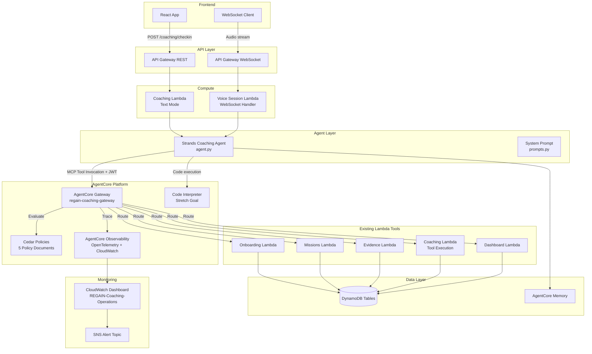
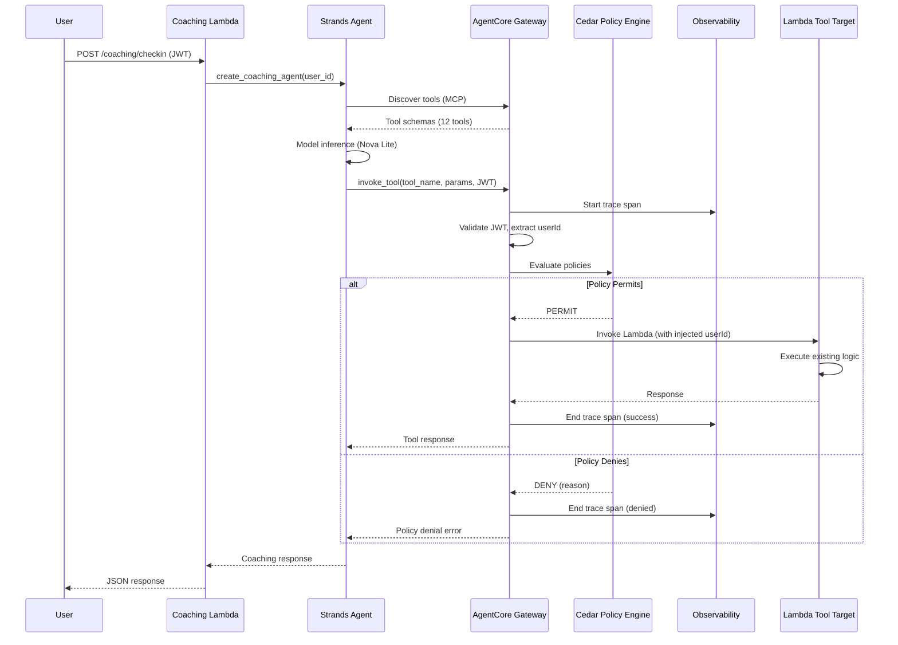
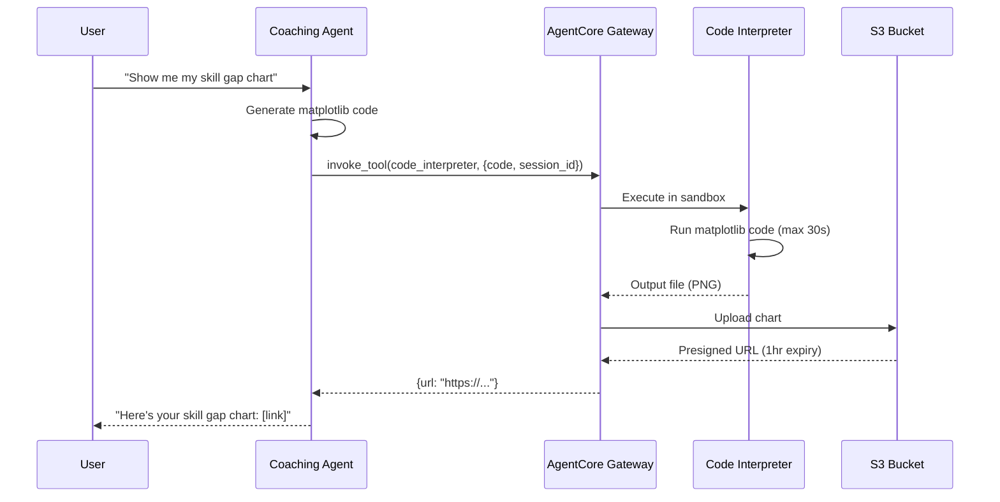

# Design Document: AgentCore Platform Integration

## Overview

This design transforms the REGAIN Coaching Agent from a prototype with direct tool invocation into a production-grade agentic system by integrating four AgentCore platform services: Gateway, Policy, Observability, and Code Interpreter (stretch).

The core architectural change is inserting AgentCore Gateway between the Coaching Agent and its existing Lambda-backed tools. Today, the Strands Agent imports 12 @tool functions directly from `backend/agents/coaching/tools.py`, each making direct boto3 calls to DynamoDB. After this integration, the agent discovers and invokes tools through the Gateway's MCP-compatible endpoint. Gateway handles JWT validation, Cedar policy evaluation, request logging, and Lambda routing — all transparently to the existing tool logic.

Nothing changes below the Gateway layer. The existing tool functions, 5 Lambda handlers, 5 DynamoDB tables, Cognito auth, API Gateway REST/WebSocket endpoints, and AgentCore Memory integration all remain as-is. Gateway wraps; it does not replace.

**Note:** The existing `get_alignment` tool function exists in `tools.py` but is not currently registered in the agent's `_ALL_TOOLS` list. This migration registers it in Gateway alongside the 12 currently active tools, bringing the total to 13 Gateway-managed tools.

### Key Design Decisions

1. **Single Gateway instance** — All 12 tools register under one "regain-coaching-gateway" instance. Simpler management, single auth configuration, unified policy attachment point.
2. **JWT passthrough** — Gateway validates the same Cognito JWT tokens already used by API Gateway. No separate identity provider. userId is extracted from JWT claims and injected into tool context, preventing the agent from spoofing user identity.
3. **Cedar policies at Gateway** — Policy enforcement happens outside the agent's reasoning loop. Even if the agent hallucinates a cross-user tool call, the policy blocks it before it reaches Lambda.
4. **New CDK stack** — AgentCore resources get their own `AgentCoreStack` rather than extending the existing `AgentStack`. Clean separation of concerns: AgentStack owns compute (Lambda, WebSocket), AgentCoreStack owns platform services (Gateway, Policy, Observability).
5. **Observability via AgentCore native** — Uses AgentCore Observability's built-in OpenTelemetry integration rather than manual instrumentation. Traces are auto-captured for Gateway-routed tool calls.

## Architecture



### Tool Invocation Flow (Post-Migration)



## Components and Interfaces

### 1. Gateway Client Module (`backend/agents/coaching/gateway_client.py`)

A thin wrapper that the Coaching Agent uses to invoke tools through AgentCore Gateway instead of direct imports. Replaces the direct tool list in `agent.py`.

```python
import os
import boto3
from typing import Any

class GatewayToolClient:
    """Client for invoking coaching tools through AgentCore Gateway."""

    def __init__(self, gateway_id: str, jwt_token: str):
        self.gateway_id = gateway_id
        self.jwt_token = jwt_token
        self.client = boto3.client(
            "bedrock-agentcore",
            region_name=os.environ.get("AWS_REGION", "us-east-1"),
        )

    def discover_tools(self) -> list[dict[str, Any]]:
        """Discover available tools from the Gateway via MCP protocol."""
        ...

    def invoke_tool(self, tool_name: str, params: dict[str, Any]) -> dict[str, Any]:
        """Invoke a tool through Gateway with JWT auth and policy evaluation."""
        ...
```

### 2. Updated Agent Configuration (`backend/agents/coaching/agent.py`)

The agent switches from importing tool functions directly to discovering them from Gateway. The `create_coaching_agent` function gains a `jwt_token` parameter.

```python
def create_coaching_agent(user_id: str, jwt_token: str) -> Agent:
    """Create a Coaching Agent that routes tools through AgentCore Gateway.

    Args:
        user_id: The authenticated user's ID.
        jwt_token: The user's Cognito JWT for Gateway authorization.

    Returns:
        A configured Strands Agent with Gateway-routed tools.
    """
    gateway_id = os.environ.get("AGENTCORE_GATEWAY_ID", "regain-coaching-gateway")
    gateway_client = GatewayToolClient(gateway_id, jwt_token)
    gateway_tools = gateway_client.discover_tools()

    model = BedrockModel(
        model_id=os.environ.get("BEDROCK_MODEL_ID", "amazon.nova-lite-v1:0"),
        region_name=os.environ.get("AWS_REGION", "us-east-1"),
    )

    return Agent(
        model=model,
        system_prompt=get_system_prompt(),
        tools=gateway_tools,
    )
```

### 3. MCP Tool Schema Registry

All 12 tools are registered with typed schemas. Each schema maps to the existing @tool function signature.

#### Tool Schema Definitions

| Tool Name | Lambda Target | Input Schema | Output Schema |
|-----------|--------------|--------------|---------------|
| `regain_read_user_profile` | Coaching Lambda | `{ userId: string (injected from JWT) }` | `{ userId, name, email, persona, target_role, skills, onboarding_completed, created_at }` |
| `regain_update_user_profile` | Coaching Lambda | `{ userId: string (injected), updates: object }` | `{ userId, ...updated_fields }` |
| `regain_get_campaign_status` | Coaching Lambda | `{ userId: string (injected) }` | `{ userId, campaignId, title, phase, status, startDate, targetRole, skillsFocus }` |
| `regain_create_campaign` | Coaching Lambda | `{ userId: string (injected), title: string, targetRole: string, skillsFocus: string[] }` | `{ userId, campaignId, title, phase, status, startDate, targetRole, skillsFocus }` |
| `regain_get_current_mission` | Missions Lambda | `{ userId: string (injected) }` | `{ userId, missionId, campaignId, title, description, status, skillTag, patterns }` |
| `regain_generate_mission` | Missions Lambda | `{ userId: string (injected), campaignId: string }` | `{ primary: mission, alternates: mission[], skill_gap_report }` |
| `regain_complete_mission` | Evidence Lambda | `{ userId: string (injected), missionId: string, reflection: string, skillTag: string, artifactUrl?: string }` | `{ mission_id, difficulty_change, gate_result, evidence_id, skill_evidence_count }` |
| `regain_log_evidence` | Evidence Lambda | `{ userId: string (injected), missionId: string, skillTag: string, reflection: string, artifactUrl?: string }` | `{ evidence_id, skill_evidence_count }` |
| `regain_get_evidence_summary` | Evidence Lambda | `{ userId: string (injected) }` | `{ by_skill, recent, total_count }` |
| `regain_get_market_insights` | Market Intel Lambda | `{ roleId: string }` | `{ role_id, demand_score, trend_direction, growth_rate, top_skills, salary_range, insights }` |
| `regain_get_alignment` | Market Intel Lambda | `{ userId: string (injected), targetRoleId: string }` | `{ alignment_pct, skill_breakdown, top_gaps, top_strengths, target_role_id, user_id, calculated_at }` |
| `regain_recall_memory` | Coaching Lambda | `{ userId: string (injected), query: string }` | `list[{ content, metadata }]` |
| `regain_store_memory` | Coaching Lambda | `{ userId: string (injected), content: string }` | `{ status, namespace }` |

Key design point: `userId` is marked as "injected from JWT" — Gateway extracts it from the validated token and passes it to the Lambda. The agent never supplies userId directly, preventing privilege escalation.

### 4. Cedar Policy Documents

Five Cedar policies attached to the Gateway. Each policy is defined as a structured document in CDK and also provided as Cedar code for validation.

#### Policy 1: User Data Isolation

```cedar
permit(
    principal,
    action in [Action::"invoke_tool"],
    resource
) when {
    resource.tool_params.userId == context.auth.userId
};

forbid(
    principal,
    action in [Action::"invoke_tool"],
    resource
) when {
    resource.tool_params.userId != context.auth.userId
};
```

#### Policy 2: Evidence Write Scope

Cedar enforces only conditions derivable from request context without database queries: active session and recent timestamp. The campaign-completed check is enforced in the existing `log_evidence` Lambda service logic, where it already has DynamoDB access — this avoids giving Gateway DynamoDB permissions and eliminates a stale-context risk.

```cedar
permit(
    principal,
    action in [Action::"invoke_tool"],
    resource
) when {
    resource.tool_name == "regain_log_evidence" &&
    context.session.is_active == true &&
    context.evidence_timestamp.within_last_24h == true
};

forbid(
    principal,
    action in [Action::"invoke_tool"],
    resource
) when {
    resource.tool_name == "regain_log_evidence" &&
    (context.session.is_active == false ||
     context.evidence_timestamp.within_last_24h == false)
};
```

**Note:** The campaign status check (`campaign.status != "completed"`) is enforced in the `log_evidence` Lambda handler, not in Cedar. This is intentional — querying DynamoDB for campaign status at the policy layer would require Gateway to have DynamoDB read permissions and would add latency to every evidence write. The Lambda already has this access and can enforce it atomically.

#### Policy 3: Mission Generation Rate Limit

Primary enforcement is atomic in DynamoDB: the `generate_mission` Lambda uses a conditional update (`ADD dailyMissionGenCount 1` with condition `dailyMissionGenCount < 3`) on the UserProfiles table. This handles concurrency correctly — two simultaneous calls at count=2 will have one succeed and one fail the condition expression. The Cedar policy below is a defense-in-depth backstop using the pre-fetched count from the Gateway context builder.

```cedar
permit(
    principal,
    action in [Action::"invoke_tool"],
    resource
) when {
    resource.tool_name == "regain_generate_mission" &&
    context.daily_generation_count < 3
};

forbid(
    principal,
    action in [Action::"invoke_tool"],
    resource
) when {
    resource.tool_name == "regain_generate_mission" &&
    context.daily_generation_count >= 3
};
```

**DynamoDB schema addition:** Add `dailyMissionGenCount` (Number, default 0) and `lastMissionGenDate` (String, ISO date) attributes to UserProfiles. The `generate_mission` Lambda resets the counter when `lastMissionGenDate` differs from today's date, then atomically increments with a condition check. This is the primary rate limit gate; the Cedar policy catches any edge cases where the context count is stale.

#### Policy 4: Profile Update Restrictions

**Implementation note:** The Cedar syntax below uses `.keys().containsOnly()` and `.containsAny()` as pseudocode — these are not standard Cedar built-ins. The actual implementation will model allowed/restricted fields as Cedar entity attributes or perform the field allowlist check in the Gateway's context-building step before Cedar evaluation, passing a boolean `all_fields_allowed` into the Cedar context.

```cedar
permit(
    principal,
    action in [Action::"invoke_tool"],
    resource
) when {
    resource.tool_name == "regain_update_user_profile" &&
    context.all_fields_allowed == true
};

forbid(
    principal,
    action in [Action::"invoke_tool"],
    resource
) when {
    resource.tool_name == "regain_update_user_profile" &&
    context.all_fields_allowed == false
};
```

The Gateway context builder checks whether all field keys in `updates` are within the allowed set (`skills`, `experience`, `targetRoles`, `preferences`, `transferable_skills`, `technical_skills`, `domain_knowledge`, `experience_years`, `industry`, `role_history`, `persona`, `onboarding_completed`, `target_role`) and sets `context.all_fields_allowed` accordingly. If any field is in the restricted set (`email`, `cognitoId`, `role`, `tier`, `userId`), the context flag is `false` and Cedar denies.

#### Policy 5: Market Data Read-Only

```cedar
permit(
    principal,
    action in [Action::"invoke_tool"],
    resource
) when {
    resource.tool_name in ["regain_get_market_insights", "regain_get_alignment"]
};

forbid(
    principal,
    action in [Action::"invoke_tool"],
    resource
) when {
    resource.target_table == "MarketData" &&
    context.operation_type in ["write", "update", "delete"]
};
```

### 5. Observability Configuration

#### Trace Schema

Each Coaching_Session produces a trace with the following span hierarchy:

```
coaching_session (root span)
├── memory_recall (AgentCore Memory read)
├── model_inference (Nova Lite / Nova Sonic)
│   ├── input_tokens: int
│   ├── output_tokens: int
│   └── latency_ms: int
├── tool_invocation (one per tool call)
│   ├── tool_name: string
│   ├── gateway_routing_ms: int
│   ├── policy_evaluation_ms: int
│   ├── policy_result: "permit" | "deny"
│   ├── lambda_execution_ms: int
│   └── dynamodb_operation_ms: int
├── tool_invocation (repeated)
│   └── ...
├── model_inference (follow-up reasoning)
│   └── ...
└── memory_store (AgentCore Memory write)
```

#### CloudWatch Dashboard: REGAIN-Coaching-Operations

```
┌─────────────────────┬──────────────────┬─────────────────┐
│ Session Count        │ Active Users     │ Error Rate      │
│ (Time Series)        │ (Counter)        │ (Gauge)         │
├─────────────────────┼──────────────────┼─────────────────┤
│ Tool Invocation      │ Policy Denial    │ Token Usage     │
│ Heatmap              │ Log (Table)      │ (Stacked Area)  │
│ (tool × time)        │                  │ (in/out split)  │
├─────────────────────┼──────────────────┼─────────────────┤
│ Latency Percentiles  │ Memory Ops       │                 │
│ (p50/p95/p99 lines)  │ (Bar Chart)      │                 │
└─────────────────────┴──────────────────┴─────────────────┘
```

#### Alert Definitions

| Alert | Condition | Threshold | Action |
|-------|-----------|-----------|--------|
| High Error Rate | Error rate across all tools | > 10% over 5 min | SNS notification |
| High Latency | p95 tool invocation latency | > 5 seconds | SNS notification |
| Policy Denial Spike | Policy denial count | > 20 in 1 minute | SNS notification |

### 6. Code Interpreter Integration (Stretch Goal)



**Sandbox constraints:**
- Pre-installed: matplotlib, pandas, numpy
- No network access, no filesystem outside sandbox, no AWS credentials
- Max execution: 30 seconds per run
- Max memory: 512MB per session
- Auto-terminate after 5 minutes of inactivity
- One session per coaching session (reused within session)

### 7. CDK Stack: AgentCoreStack (`infra/stacks/agentcore_stack.py`)

New CDK stack responsible for all AgentCore platform resources.

```python
class AgentCoreStack(cdk.Stack):
    """AgentCore platform services: Gateway, Policy, Observability, Alerting."""

    def __init__(
        self,
        scope,
        construct_id,
        *,
        coaching_lambda,
        missions_lambda,
        evidence_lambda,
        market_intel_lambda,
        dashboard_lambda,
        user_pool,
        **kwargs,
    ):
        # 1. Create AgentCore Gateway instance
        # 2. Register 12 tool schemas with Lambda targets
        # 3. Configure Gateway auth with Cognito User Pool
        # 4. Define and attach 5 Cedar policies
        # 5. Configure AgentCore Observability
        # 6. Create CloudWatch dashboard
        # 7. Create SNS topic and CloudWatch alarms
        # 8. Create IAM roles for Gateway → Lambda, Agent → Gateway
        # 9. Export Gateway endpoint URL via CfnOutput
```

**Cross-stack dependencies:**
- Receives Lambda function references from ApiStack
- Receives User Pool reference from AuthStack
- Exports Gateway endpoint URL for agent configuration

## Data Models

### No New DynamoDB Tables

This spec creates zero new DynamoDB tables. All data operations continue to use the existing 5 tables (UserProfiles, Campaigns, MissionHistory, EvidenceVault, MarketData) through the existing Lambda tool logic.

### New Configuration Data

| Configuration | Storage | Description |
|--------------|---------|-------------|
| Gateway ID | Environment variable `AGENTCORE_GATEWAY_ID` | Gateway instance identifier |
| Gateway endpoint | Environment variable `AGENTCORE_GATEWAY_ENDPOINT` | Gateway MCP endpoint URL |
| Tool schemas | AgentCore Gateway registry | 12 MCP tool definitions (managed by Gateway) |
| Cedar policies | AgentCore Policy store | 5 policy documents (managed by Gateway) |
| Dashboard definition | CloudWatch | Dashboard JSON (managed by CDK) |
| Alert thresholds | CloudWatch Alarms | 3 alarm definitions (managed by CDK) |
| SNS topic ARN | Environment variable `ALERT_SNS_TOPIC_ARN` | Alert notification target |

### Policy Evaluation Context Schema

Each tool invocation provides this context to the Cedar policy engine. Context fields are derived from the request itself (JWT, timestamp, session state) and a lightweight UserProfiles read for rate limit data. No campaign or evidence table queries are needed at the policy layer.

```python
PolicyContext = {
    "auth": {
        "userId": str,          # From JWT claims
        "email": str,           # From JWT claims
        "token_issuer": str,    # Cognito User Pool URL
    },
    "session": {
        "is_active": bool,      # Whether coaching session is active
        "session_id": str,      # Current session identifier
    },
    "tool": {
        "tool_name": str,       # MCP tool name
        "tool_params": dict,    # Input parameters
        "target_table": str,    # DynamoDB table being accessed (if applicable)
        "operation_type": str,  # "read" | "write" | "update" | "delete"
    },
    "rate_limits": {
        "daily_generation_count": int,  # From UserProfiles.dailyMissionGenCount
    },
    "evidence_timestamp": {
        "within_last_24h": bool,  # Computed from request timestamp vs now
    },
}
```

**What's NOT in policy context (by design):**
- `campaign.status` — Enforced in Lambda tool logic, not Cedar. Avoids giving Gateway DynamoDB read permissions on the Campaigns table.
- Sensitive user data — Only userId and email from JWT, no profile fields.

### S3 Bucket for Code Interpreter Output (Stretch Goal)

| Field | Value |
|-------|-------|
| Bucket name | `regain-code-interpreter-output-{account_id}` |
| Lifecycle | Objects expire after 24 hours |
| Access | Presigned URLs with 1-hour expiry |
| Encryption | SSE-S3 |


## Correctness Properties

*A property is a characteristic or behavior that should hold true across all valid executions of a system — essentially, a formal statement about what the system should do. Properties serve as the bridge between human-readable specifications and machine-verifiable correctness guarantees.*

The following properties were derived from the acceptance criteria in the requirements document. Each property is universally quantified and designed for property-based testing. Properties were consolidated after redundancy analysis to ensure each provides unique validation value.

### Property 1: MCP schema correctness

*For any* registered tool in the AgentCore Gateway, the MCP tool schema SHALL specify input parameters with JSON Schema types matching the corresponding Strands @tool function signature, output structure matching the tool's return dict shape, and a non-empty natural language description.

**Validates: Requirements 1.3, 2.1, 2.2, 2.3**

### Property 2: JWT validation and userId injection

*For any* tool invocation with a valid Cognito JWT token, the userId injected into the tool invocation context by the Gateway SHALL equal the userId from the JWT claims. *For any* tool invocation with an invalid or missing JWT token, the Gateway SHALL reject the request before routing to the Lambda target.

**Validates: Requirements 1.5, 1.6**

### Property 3: Gateway routing equivalence

*For any* tool invocation with valid parameters and a valid JWT, routing the invocation through AgentCore Gateway SHALL produce a response equivalent to invoking the same tool function directly with the same parameters.

**Validates: Requirements 3.3, 3.4**

### Property 4: User data isolation

*For any* tool invocation, the Cedar policy SHALL permit the invocation if and only if the userId in the request parameters matches the userId extracted from the JWT claims. *For any* mismatch between request userId and JWT userId, the Gateway SHALL return a Policy Denial.

**Validates: Requirements 4.1, 4.2**

### Property 5: Evidence write scope enforcement

*For any* log_evidence tool invocation, the Cedar policy SHALL permit the invocation if and only if both conditions hold: the coaching session is active and the evidence timestamp is within the last 24 hours. Violation of either condition SHALL result in a Policy Denial. The campaign-completed check is enforced separately in the Lambda tool logic, not in Cedar.

**Validates: Requirements 5.1, 5.2**

### Property 6: Mission generation rate limit

*For any* user with a daily mission generation count of N, the Cedar policy SHALL permit the generate_mission tool if and only if N < 3. When N >= 3, the Gateway SHALL return a Policy Denial with reason "daily mission generation limit reached".

**Validates: Requirements 6.1, 6.2**

### Property 7: Mission generation counter atomicity

*For any* permitted generate_mission tool invocation, the DynamoDB conditional update on UserProfiles SHALL atomically increment `dailyMissionGenCount` by exactly 1 and succeed only when the pre-increment value is less than 3. Two concurrent invocations at count=2 SHALL result in exactly one success and one conditional check failure.

**Validates: Requirements 6.3**

### Property 8: Profile update field restrictions

*For any* update_user_profile tool invocation, the Cedar policy SHALL permit the invocation if and only if every field key in the updates parameter is a member of the allowed set (skills, experience, targetRoles, preferences, transferable_skills, technical_skills, domain_knowledge, experience_years, industry, role_history, persona, onboarding_completed, target_role). The presence of any field from the restricted set (email, cognitoId, role, tier, userId) SHALL result in a Policy Denial.

**Validates: Requirements 7.1, 7.2**

### Property 9: Market data read-only enforcement

*For any* tool invocation by the Coaching Agent targeting MarketData, read operations (get_market_insights, get_alignment) SHALL be permitted, and write, update, or delete operations SHALL be denied with a Policy Denial.

**Validates: Requirements 8.1, 8.2**

### Property 10: Policy audit log completeness

*For any* Cedar policy evaluation (permit or deny), the audit log entry SHALL contain the tool name, userId, policy name, evaluation result, and timestamp. *For any* Policy Denial specifically, the log entry SHALL additionally contain the denial reason and request context (input parameters excluding sensitive data).

**Validates: Requirements 4.3, 9.1, 9.2**

### Property 11: Input schema validation

*For any* tool invocation where the input payload does not conform to the registered MCP tool schema (missing required fields, wrong types), the Gateway SHALL reject the request with a structured validation error without invoking the Lambda target. *For any* tool invocation with a conforming input payload, the Gateway SHALL forward the request to the Lambda target.

**Validates: Requirements 2.4, 2.5**

### Property 12: Trace span completeness

*For any* model inference operation, the trace span SHALL contain model ID, input token count, output token count, and inference latency. *For any* tool invocation routed through Gateway, the trace span SHALL contain tool name, Gateway routing latency, policy evaluation result, Lambda execution latency, and DynamoDB operation latency.

**Validates: Requirements 10.2, 10.3**

### Property 13: Code interpreter output URL (Stretch Goal)

*For any* Code Interpreter execution that produces an output file, the system SHALL return a response containing a valid presigned S3 URL pointing to the generated file.

**Validates: Requirements 13.3**

## Error Handling

### Gateway-Level Errors

| Error Condition | Response | HTTP Status |
|----------------|----------|-------------|
| Invalid or expired JWT token | `{"error": "unauthorized", "message": "Invalid or expired authentication token"}` | 401 |
| Tool not found in registry | `{"error": "tool_not_found", "message": "Tool '{name}' is not registered in the gateway"}` | 404 |
| Input schema validation failure | `{"error": "validation_failed", "message": "...", "details": [{field, violation}]}` | 400 |
| Cedar policy denial | `{"error": "policy_denied", "message": "...", "policy": "policy_name", "reason": "..."}` | 403 |
| Lambda target invocation failure | `{"error": "tool_execution_failed", "message": "..."}` | 502 |
| Gateway service unavailable | `{"error": "gateway_unavailable", "message": "AgentCore Gateway is temporarily unavailable"}` | 503 |

### Agent-Level Error Handling

The Coaching Agent handles Gateway errors gracefully:

| Gateway Error | Agent Behavior |
|--------------|----------------|
| `policy_denied` (user isolation) | Should never occur in normal operation. Log as security event. Return generic error to user. |
| `policy_denied` (rate limit) | Inform user: "You've reached the daily mission limit. Let's focus on your current mission." |
| `policy_denied` (evidence scope) | Inform user: "I can't log evidence right now. Let's continue the conversation." |
| `policy_denied` (field restriction) | Agent retries without restricted fields. Transparent to user. |
| `validation_failed` | Agent reformats parameters and retries. If retry fails, inform user of temporary issue. |
| `gateway_unavailable` | Return structured error. No silent fallback to direct invocation. |

### Code Interpreter Errors (Stretch Goal)

| Error Condition | Response |
|----------------|----------|
| Code execution timeout (>30s) | `{"error": "execution_timeout", "message": "Code execution exceeded 30 second limit"}` |
| Memory limit exceeded (>512MB) | `{"error": "memory_exceeded", "message": "Code execution exceeded memory limit"}` |
| Runtime error in generated code | `{"error": "code_error", "message": "...", "traceback": "..."}` — Agent regenerates code with fix |

### Error Response Contract

All Gateway errors follow a consistent structure:

```python
{
    "error": str,       # Machine-readable error type
    "message": str,     # Human-readable description
    "policy": str,      # (optional) Policy name that triggered denial
    "reason": str,      # (optional) Specific denial reason
    "details": list,    # (optional) Validation failure details
}
```

## Testing Strategy

### Dual Testing Approach

Testing combines unit tests for specific examples and edge cases with property-based tests for universal correctness guarantees. Unit tests catch concrete bugs at known boundaries. Property tests verify general correctness across randomized inputs. Both are required.

### Property-Based Testing

**Library**: [Hypothesis](https://hypothesis.readthedocs.io/) for Python

**Configuration**:
- Minimum 100 examples per property test
- Each test tagged with design property reference
- Tag format: `# Feature: agentcore-platform-integration, Property {N}: {title}`
- Each correctness property implemented as a single `@given` test function

**Properties to implement**:

| Property | Test Approach | Key Generators |
|----------|--------------|----------------|
| P1: MCP schema correctness | Compare registered schemas against @tool function signatures via `inspect.signature` | Iterate over all 12 tool functions |
| P2: JWT validation + userId injection | Generate random JWTs (valid/invalid), invoke Gateway, verify userId injection or rejection | Random user_ids, random JWT payloads |
| P3: Gateway routing equivalence | Invoke tool directly and via Gateway with same params, compare results | Random valid tool params per tool |
| P4: User data isolation | Generate pairs of (request userId, JWT userId), verify permit iff match | Random user_id pairs |
| P5: Evidence write scope | Generate (session_active, timestamp_age) tuples, verify permit iff both conditions met. Campaign-completed check tested separately in Lambda unit tests | Random booleans, timestamps |
| P6: Mission generation rate limit | Generate (user_id, daily_count) pairs, verify permit iff count < 3 | Random user_ids, counts 0-10 |
| P7: Counter atomicity | Invoke generate_mission, verify DynamoDB conditional update increments by 1 and rejects at count >= 3 | Random user_ids with known counters |
| P8: Profile field restrictions | Generate update dicts with random field subsets from allowed + restricted sets, verify permit/deny | Random field name subsets |
| P9: Market data read-only | Generate (tool_name, operation_type) pairs, verify reads permitted and writes denied | Tool names, operation types |
| P10: Audit log completeness | Trigger policy evaluations, verify log entries contain all required fields | Random tool invocations |
| P11: Input schema validation | Generate valid and invalid input payloads per tool schema, verify accept/reject | Random payloads with type mutations |
| P12: Trace span completeness | Trigger operations, verify trace spans contain required fields | Random tool invocations |
| P13: Code interpreter output URL | Execute code that produces files, verify presigned URL in response | Random matplotlib code snippets |

### Unit Testing

Unit tests focus on:
- **Gateway client**: Connection handling, retry logic, error parsing
- **Cedar policy evaluation**: Specific deny scenarios (cross-user, rate limit hit, restricted field)
- **Schema validation**: Known-bad inputs for each of the 12 tools
- **CDK stack synthesis**: Verify stack produces expected CloudFormation resources
- **Edge cases**: Empty tool list from discovery, Gateway timeout, malformed policy response

**Mocking strategy**: Mock AgentCore Gateway API calls with `unittest.mock.patch`. Mock CloudWatch for metric/log verification. Use `moto` for any DynamoDB operations in integration paths.

**Test location**: `tests/unit/agents/coaching/` for agent-level tests, `tests/unit/infra/` for CDK tests

### What NOT to Test

- AgentCore Gateway internal routing logic (managed service)
- Cedar policy engine internals (managed service)
- CloudWatch dashboard rendering (UI concern)
- SNS notification delivery (infrastructure concern)
- LLM code generation quality for Code Interpreter (non-deterministic)
- Full end-to-end coaching sessions through Gateway (manual testing)
