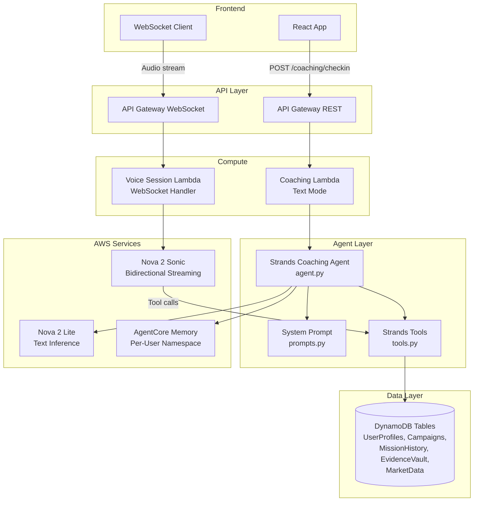

# Design Document: Coaching Agent

## Overview

The Coaching Agent is a Strands Agents SDK-based conversational AI system that serves as the intelligence layer of the REGAIN platform. It replaces the placeholder coaching service with a fully functional agent capable of conversational onboarding, daily check-in coaching, adaptive mission generation, evidence extraction, and market-informed guidance.

The agent operates in two modes:
1. **Text mode** — invoked synchronously via the existing Lambda-backed `/coaching/checkin` API Gateway endpoint. The Lambda handler delegates to the Strands Agent, which orchestrates tool calls and returns a text response.
2. **Voice mode** — a WebSocket connection from the frontend streams audio to a backend service that manages a Nova 2 Sonic bidirectional streaming session. Nova Sonic handles speech-to-speech natively. The agent's Strands tools are registered with Nova Sonic for asynchronous invocation mid-conversation.

All data operations go through Strands @tool functions that use the existing DynamoDB data access layer. AgentCore Memory provides per-user episodic memory for session continuity.

## Architecture



### Text Mode Flow

1. User sends POST to `/coaching/checkin` with `{ "message": "...", "session_type": "onboarding|checkin|general" }`
2. Coaching Lambda extracts userId from Cognito JWT claims
3. Lambda instantiates the Strands Agent with user context
4. Agent retrieves prior conversation context from AgentCore Memory
5. Agent processes the message, invoking tools as needed (read profile, get missions, log evidence, etc.)
6. Agent returns structured response with coaching text and any side effects (missions created, evidence logged)
7. Agent stores session summary in AgentCore Memory
8. Lambda returns response through API Gateway

### Voice Mode Flow

1. Frontend establishes WebSocket connection to API Gateway WebSocket API
2. Voice Lambda receives `$connect` event, authenticates via Cognito token in query string
3. On first audio frame, Lambda creates a Nova 2 Sonic session via `InvokeModelWithBidirectionalStream`
4. Audio streams bidirectionally: frontend → WebSocket → Lambda → Nova Sonic → Lambda → WebSocket → frontend
5. Nova Sonic invokes Strands tools asynchronously when the conversation requires data operations
6. On `$disconnect`, Lambda closes the Nova Sonic session and stores session summary in AgentCore Memory

## Components and Interfaces

### 1. Strands Coaching Agent (`backend/agents/coaching/agent.py`)

The central orchestrator. Configures the Strands Agent class with model, tools, system prompt, and memory.

```python
from strands import Agent
from strands.models.bedrock import BedrockModel

def create_coaching_agent(user_id: str) -> Agent:
    """Create a configured Coaching Agent instance for a specific user.

    Args:
        user_id: The authenticated user's ID for memory namespace scoping.

    Returns:
        A configured Strands Agent ready to process messages.
    """
    model = BedrockModel(
        model_id=os.environ.get("BEDROCK_MODEL_ID", "amazon.nova-lite-v1:0"),
        region_name=os.environ.get("AWS_REGION", "us-east-1"),
    )

    agent = Agent(
        model=model,
        system_prompt=get_system_prompt(),
        tools=[
            read_user_profile,
            update_user_profile,
            get_campaign_status,
            create_campaign,
            get_current_mission,
            generate_mission,
            complete_mission,
            log_evidence,
            get_evidence_summary,
            get_market_insights,
            recall_memory,
            store_memory,
        ],
    )
    return agent
```

### 2. System Prompt (`backend/agents/coaching/prompts.py`)

Defines the agent's persona, coaching philosophy, behavioral rules, and tool usage guidelines. Key sections:

- **Persona**: Experienced career transition coach. Direct, evidence-focused, warm but not sycophantic.
- **Coaching Philosophy**: Evidence over affirmation. Structure that adapts. Concrete actions over generic advice.
- **Session Types**: Onboarding (extract skills, build profile), Check-in (review progress, deliver mission), General (answer questions, log evidence).
- **Behavioral Rules**: Always reference evidence. Detect avoidance patterns. Adapt tone to user's momentum. Never give generic advice — always tie to the user's specific profile and market data.
- **Tool Usage**: Always read profile before responding. Always check mission history during check-ins. Log evidence whenever the user describes an accomplishment.

### 3. Strands Tools (`backend/agents/coaching/tools.py`)

Each tool is a pure Python function with @tool decorator. Tools use the existing `DynamoDBClient` from `backend/lambda/shared/dynamodb.py`.

#### Tool Definitions

| Tool | Input | Output | DynamoDB Table |
|------|-------|--------|----------------|
| `read_user_profile` | `user_id: str` | `dict` with profile fields | UserProfiles |
| `update_user_profile` | `user_id: str, updates: dict` | `dict` with updated profile | UserProfiles |
| `get_campaign_status` | `user_id: str` | `dict` with active campaign | Campaigns |
| `create_campaign` | `user_id: str, title: str, target_role: str, skills_focus: list` | `dict` with campaign_id | Campaigns |
| `get_current_mission` | `user_id: str` | `dict` with pending/in-progress mission | MissionHistory |
| `generate_mission` | `user_id: str, campaign_id: str, title: str, description: str, skill_tag: str` | `dict` with mission_id | MissionHistory |
| `complete_mission` | `user_id: str, mission_id: str, reflection: str, skill_tag: str, artifact_url: str?` | `dict` with evidence_id | MissionHistory + EvidenceVault |
| `log_evidence` | `user_id: str, mission_id: str, skill_tag: str, reflection: str, artifact_url: str?` | `dict` with evidence_id, skill_count | EvidenceVault |
| `get_evidence_summary` | `user_id: str` | `dict` with skill counts and recent evidence | EvidenceVault |
| `get_market_insights` | `sector: str` | `dict` with job trends, skill demand, salary ranges | MarketData |
| `recall_memory` | `user_id: str, query: str` | `list[dict]` of relevant memory entries | AgentCore Memory |
| `store_memory` | `user_id: str, content: str` | `dict` with confirmation | AgentCore Memory |

#### Tool Input/Output Contracts

```python
# read_user_profile
# Input: user_id (str)
# Output:
{
    "user_id": "abc-123",
    "name": "Jane",
    "persona": "ai_displaced",
    "target_role": "AI Quality Assurance Engineer",
    "skills": ["manual_testing", "test_automation", "python", "ci_cd"],
    "onboarding_completed": True
}

# generate_mission
# Input: user_id, campaign_id, title, description, skill_tag
# Output:
{
    "mission_id": "m-456",
    "title": "Document Your Testing Methodology",
    "description": "Write down three times you caught a critical bug...",
    "skill_tag": "systematic_debugging",
    "status": "pending"
}

# log_evidence
# Input: user_id, mission_id, skill_tag, reflection, artifact_url (optional)
# Output:
{
    "evidence_id": "e-789",
    "skill_tag": "systematic_debugging",
    "skill_evidence_count": 3
}

# get_market_insights
# Input: sector (str)
# Output:
{
    "sector": "quality_assurance",
    "job_trends": {"ai_qa_engineer": "+40% YoY", "test_automation": "+25% YoY"},
    "skill_demand": ["python", "selenium", "ai_testing", "ci_cd"],
    "salary_ranges": {"entry": "75k-90k", "mid": "95k-120k", "senior": "125k-160k"},
    "data_source": "market_scan_2025_01"
}
```

### 4. Coaching Lambda Handler (updated `backend/lambda/coaching/handler.py`)

The existing handler is updated to instantiate the Strands Agent instead of the placeholder service. Remains a thin wrapper.

```python
def lambda_handler(event, context):
    user_id = _get_user_id(event)
    body = json.loads(event.get("body", "{}"))
    message = body.get("message", "")
    session_type = body.get("session_type", "checkin")

    agent = create_coaching_agent(user_id)
    result = agent(f"[session_type={session_type}] [user_id={user_id}] {message}")

    return success_response({
        "response": str(result),
        "userId": user_id,
    })
```

### 5. Voice Session Handler (`backend/lambda/coaching/voice_handler.py`)

New Lambda for WebSocket API Gateway. Manages Nova 2 Sonic bidirectional streaming sessions.

```python
# $connect: authenticate, store connection_id → user_id mapping
# $default: receive audio frames, forward to Nova Sonic session
# $disconnect: close Nova Sonic session, store memory summary
```

The voice handler uses `boto3` to call `bedrock-runtime` `InvokeModelWithBidirectionalStream` with:
- Model ID: `amazon.nova-sonic-v1:0`
- Audio format: PCM 16-bit, 16kHz
- Tool configuration: same Strands tools registered for async invocation

### 6. AgentCore Memory Integration

Memory operations are scoped per-user via namespace:

```python
# Namespace format: "regain-coaching-{user_id}"
# Store: session summaries, key decisions, detected patterns
# Recall: semantic search on query + recency weighting
```

Memory is accessed through two Strands tools (`recall_memory`, `store_memory`) that wrap the AgentCore Memory API. The agent's system prompt instructs it to recall memory at session start and store a summary at session end.

### 7. Behavioral Pattern Analyzer

Pattern detection is implemented as logic within the agent's tool layer rather than a separate service. The `get_current_mission` and `get_evidence_summary` tools return enriched data that includes pattern signals:

```python
def _analyze_patterns(missions: list[dict]) -> dict:
    """Analyze mission completion patterns for behavioral signals.

    Args:
        missions: List of mission records for the user.

    Returns:
        Dict with pattern analysis: skill category distribution,
        completion rates by category, avoidance signals.
    """
    # Count completions by skill_tag category
    # Identify categories with 0 completions but assigned missions
    # Flag categories where skip rate > 50%
    # Return structured pattern summary
```

This analysis is included in tool outputs so the agent can reference it in coaching responses.

## Data Models

### Existing Models (No Changes)

The following dataclasses from `backend/lambda/shared/models.py` are used as-is:
- `UserProfile` — extended with richer skills data via `update_user_profile` tool
- `Campaign` — phases mapped to Foundation/Expansion/Launch
- `Mission` — status lifecycle: pending → in_progress → completed/skipped
- `Evidence` — skill_tag + reflection + optional artifact_url

### New Data Structures (Tool-Internal)

These are dict structures used within Strands tools, not new DynamoDB tables:

```python
# Transition Profile (written to UserProfiles.skills as structured data)
TransitionProfile = {
    "transferable_skills": ["leadership", "project_management", "communication"],
    "technical_skills": ["python", "test_automation", "ci_cd"],
    "domain_knowledge": ["software_qa", "agile_methodology"],
    "experience_years": 8,
    "industry": "technology",
    "role_history": ["QA Lead", "Senior QA Engineer", "QA Analyst"],
    "persona": "ai_displaced"
}

# Pattern Analysis (returned by _analyze_patterns)
PatternAnalysis = {
    "total_missions": 15,
    "completed": 10,
    "skipped": 3,
    "pending": 2,
    "by_category": {
        "technical": {"assigned": 8, "completed": 7, "skipped": 1},
        "networking": {"assigned": 4, "completed": 1, "skipped": 2},
        "reflection": {"assigned": 3, "completed": 2, "skipped": 0}
    },
    "avoidance_signals": ["networking"],
    "strength_signals": ["technical"]
}

# Session Summary (stored in AgentCore Memory)
SessionSummary = {
    "session_type": "checkin",
    "timestamp": "2025-01-15T09:00:00Z",
    "key_topics": ["mission review", "networking avoidance"],
    "evidence_logged": ["e-789"],
    "missions_delivered": ["m-456"],
    "coaching_notes": "User continues to avoid networking missions. Gently redirected."
}
```

### AgentCore Memory Schema

Memory entries are stored per-user with the following structure:

| Field | Type | Description |
|-------|------|-------------|
| namespace | string | `regain-coaching-{user_id}` |
| content | string | Session summary or key observation |
| metadata | dict | `{ session_type, timestamp, tags }` |

Retrieval uses semantic search (query relevance) combined with recency weighting to surface the most contextually appropriate memories.

## Correctness Properties

*A property is a characteristic or behavior that should hold true across all valid executions of a system — essentially, a formal statement about what the system should do. Properties serve as the bridge between human-readable specifications and machine-verifiable correctness guarantees.*

The following properties were derived from the acceptance criteria in the requirements document. Each property is universally quantified and designed for property-based testing.

### Property 1: Profile update round trip

*For any* valid Transition Profile dict containing skills, experience_years, industry, and role_history fields, calling `update_user_profile` followed by `read_user_profile` for the same user_id should return a profile containing all the updated fields with equivalent values.

**Validates: Requirements 1.4**

### Property 2: Skill taxonomy partitioning

*For any* set of extracted skills, classifying them into the Skill_Taxonomy should produce exactly three non-overlapping categories (transferable_skills, technical_skills, domain_knowledge) where the union of all three categories equals the original skill set and no skill appears in more than one category.

**Validates: Requirements 1.2**

### Property 3: Campaign creation round trip

*For any* valid campaign parameters (user_id, title, target_role, skills_focus), calling `create_campaign` followed by `get_campaign_status` for the same user_id should return a campaign with matching title, target_role, skills_focus, phase set to "foundation", and status set to "active".

**Validates: Requirements 2.1, 2.2**

### Property 4: Mission generation round trip and structure

*For any* valid mission parameters (user_id, campaign_id, title, description, skill_tag), calling `generate_mission` should return a dict containing all required keys (mission_id, title, description, skill_tag, status) with status set to "pending", and subsequently calling `get_current_mission` for the same user_id should return a mission with matching fields.

**Validates: Requirements 2.3, 7.2, 7.3**

### Property 5: Mission skill alignment

*For any* generated mission for a user, the mission's skill_tag should be present in the user's Transition Profile skills (the union of transferable_skills, technical_skills, and domain_knowledge) or in the MarketData skill_demand list for the user's target sector.

**Validates: Requirements 2.4**

### Property 6: Evidence logging round trip with count accuracy

*For any* valid evidence parameters (user_id, mission_id, skill_tag, reflection), calling `log_evidence` should return a dict with evidence_id and skill_evidence_count, and the returned skill_evidence_count should equal the total number of evidence records in the EvidenceVault for that user_id and skill_tag combination.

**Validates: Requirements 5.2, 5.3, 5.4**

### Property 7: Memory store-recall round trip

*For any* user_id and session summary string, calling `store_memory` followed by `recall_memory` with a semantically related query should return results that include the stored content.

**Validates: Requirements 3.5, 10.2**

### Property 8: Memory namespace isolation

*For any* two distinct user_ids, storing a memory entry for user A and then recalling with user B's namespace should return results that do not contain user A's stored content.

**Validates: Requirements 9.5, 10.3**

### Property 9: Behavioral pattern detection accuracy

*For any* mission history where a skill category has more than 50% skip rate, the `_analyze_patterns` function should include that category in the avoidance_signals list. Conversely, for any skill category with 0% skip rate and at least one completion, it should appear in strength_signals.

**Validates: Requirements 4.1**

## Error Handling

### Tool-Level Errors

| Error Condition | Handling Strategy |
|----------------|-------------------|
| DynamoDB item not found | Tool returns `{"error": "not_found", "message": "..."}`. Agent uses this to guide conversation (e.g., "Let's set up your profile first"). |
| DynamoDB write failure | Tool catches `ClientError`, logs the error, returns `{"error": "write_failed", "message": "..."}`. Agent informs user and suggests retry. |
| AgentCore Memory unavailable | Tool catches connection errors, returns empty results. Agent proceeds without memory context and notes the gap. |
| Invalid tool input | Tool validates inputs before DynamoDB calls. Returns `{"error": "invalid_input", "message": "..."}` with specific field details. |

### Agent-Level Errors

| Error Condition | Handling Strategy |
|----------------|-------------------|
| Bedrock model invocation failure | Lambda catches the exception, returns a generic error response via `error_response()`. Frontend shows retry prompt. |
| Tool execution timeout | Strands SDK handles tool timeouts. Agent receives error and can retry or skip the tool call. |
| Malformed user input | Agent handles gracefully via system prompt instructions — asks for clarification rather than failing. |

### Voice Session Errors

| Error Condition | Handling Strategy |
|----------------|-------------------|
| Nova Sonic session creation failure | Voice handler returns a WebSocket message indicating fallback to text mode. Frontend switches to text input. |
| Audio stream interruption | Voice handler detects disconnect, closes Nova Sonic session, stores partial session summary. |
| WebSocket authentication failure | `$connect` handler rejects the connection with 401. Frontend prompts re-authentication. |

### Error Response Contract

All tool errors follow a consistent structure:
```python
{
    "error": "error_type",  # one of: not_found, write_failed, invalid_input, service_unavailable
    "message": "Human-readable description of what went wrong"
}
```

The agent's system prompt includes instructions to handle error responses gracefully and never expose raw error details to the user.

## Testing Strategy

### Dual Testing Approach

Testing combines unit tests for specific examples and edge cases with property-based tests for universal correctness guarantees. Both are complementary — unit tests catch concrete bugs at known boundaries, property tests verify general correctness across randomized inputs.

### Property-Based Testing

**Library**: [Hypothesis](https://hypothesis.readthedocs.io/) for Python

**Configuration**:
- Minimum 100 examples per property test
- Each test tagged with design property reference
- Tag format: `# Feature: coaching-agent, Property {N}: {title}`

**Properties to implement** (from Correctness Properties section):

| Property | Test Description | Key Generators |
|----------|-----------------|----------------|
| P1: Profile update round trip | Write profile, read back, assert equivalence | Random user_id, skills lists, experience_years, industry strings |
| P2: Skill taxonomy partitioning | Classify skills, assert partition properties | Random skill name lists |
| P3: Campaign creation round trip | Create campaign, read back, assert field match | Random user_id, title, target_role, skills_focus |
| P4: Mission generation round trip | Generate mission, read back, assert structure | Random mission params |
| P5: Mission skill alignment | Generate mission, assert skill_tag in profile or market skills | Random profiles with known skills |
| P6: Evidence logging round trip + count | Log evidence N times, assert count equals N | Random evidence params, random N |
| P7: Memory store-recall round trip | Store content, recall with related query, assert content found | Random user_id, summary strings |
| P8: Memory namespace isolation | Store for user A, recall for user B, assert no leakage | Random distinct user_id pairs |
| P9: Pattern detection accuracy | Generate mission histories with known skip rates, assert correct signals | Random mission lists with controlled skip distributions |

Each property MUST be implemented as a single Hypothesis `@given` test function.

### Unit Testing

Unit tests focus on:
- **Tool input validation**: Verify tools reject missing/invalid parameters
- **Edge cases**: Empty mission history, user with no profile, zero evidence records
- **Error handling**: DynamoDB failures, missing table configuration
- **Voice handler**: WebSocket connect/disconnect lifecycle, auth failure

**Mocking strategy**: Use `moto` to mock DynamoDB. Mock AgentCore Memory and Bedrock calls with `unittest.mock.patch`.

**Test location**: `tests/unit/agents/coaching/` mirroring `backend/agents/coaching/`

### What NOT to Test

- LLM output quality (non-deterministic, requires human evaluation)
- Agent orchestration sequences (integration concern, not unit testable)
- Nova Sonic audio quality (hardware/network dependent)
- Full end-to-end flows (use manual testing for these)
