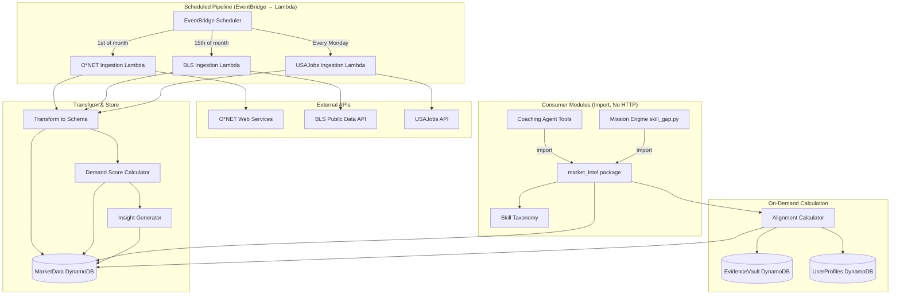

# Design Document: Market Intelligence System

## Overview

The Market Intelligence System is a set of Python modules at `backend/lambda/market_intel/` that provide three capabilities: (1) scheduled data ingestion from free public APIs into the existing MarketData DynamoDB table, (2) computation of demand scores and user-to-market alignment percentages, and (3) generation of structured insight objects consumed by the Coaching Agent and Mission Engine.

The system is NOT a separate microservice. It is an importable Python package. The Coaching Agent's `get_market_insights` tool and the Mission Engine's `analyze_skill_gaps` function call into it directly. External API calls happen only in scheduled Lambda functions triggered by EventBridge Scheduler — never during user-facing requests.

### Key Design Decisions

1. **Evolve existing table schema**: The MarketData table (PK: `sector`, SK: `timestamp`) is reused. We store role-level data by using the role identifier as the `sector` value (e.g., `role:ai_qa_engineer`) and ISO date as `timestamp`. This avoids creating new tables while supporting role-granular queries.
2. **Static skill taxonomy**: The taxonomy is a Python module (`taxonomy.py`) containing a dict of ~200 canonical skills with aliases. No database table, no ML matching — deterministic alias lookup only.
3. **On-demand alignment**: Alignment percentages are calculated on-demand when requested, not pre-cached. This avoids stale scores and extra DynamoDB writes. The calculation is fast (single query + in-memory math).
4. **Structured insights, not prose**: Insights are dicts with templates and data payloads. The Coaching Agent personalizes delivery. The system never generates free-text market analysis.

## Architecture



## Components and Interfaces

### Module Structure

```
backend/lambda/market_intel/
├── __init__.py          # Public API exports
├── taxonomy.py          # Skill taxonomy (static data + normalization functions)
├── scoring.py           # Demand score calculation
├── alignment.py         # User-to-market alignment calculation
├── insights.py          # Insight generation
├── ingestion/
│   ├── __init__.py
│   ├── onet.py          # O*NET API client and transformer
│   ├── bls.py           # BLS API client and transformer
│   ├── usajobs.py       # USAJobs API client and transformer
│   └── retry.py         # Shared retry logic with exponential backoff
├── seed.py              # Seed data loader
└── handler.py           # Lambda handler entry points for scheduled ingestion
```

### Public API (`__init__.py`)

```python
# Functions exposed for import by Coaching Agent and Mission Engine

def get_demand_score(role_id: str) -> dict | None:
    """Retrieve the latest demand score record for a role."""

def calculate_alignment(
    user_id: str,
    target_role_id: str,
) -> dict:
    """Calculate user-to-market alignment for a target role."""

def get_insights(
    role_id: str | None = None,
    user_id: str | None = None,
    insight_type: str | None = None,
) -> list[dict]:
    """Query market insights filtered by role, user, or type."""

def normalize_skill(skill_string: str) -> str | None:
    """Normalize a skill string to a canonical skill name."""

def get_role_skills(role_id: str) -> list[dict]:
    """Get the ranked skill requirements for a role."""
```

### Ingestion Pipeline Interface

Each ingestion module exposes a single `ingest()` function:

```python
# onet.py
def ingest(role_ids: list[str]) -> dict:
    """Fetch O*NET data for given roles, transform, and write to DynamoDB.
    
    Returns:
        Dict with 'succeeded' (list of role_ids) and 'failed' (list of dicts
        with role_id and error message).
    """

# bls.py  
def ingest(series_ids: list[str]) -> dict:
    """Fetch BLS series data, transform, and merge into DynamoDB."""

# usajobs.py
def ingest(keywords: list[str]) -> dict:
    """Fetch USAJobs posting data, transform, and merge into DynamoDB."""
```

### Retry Module

```python
def retry_with_backoff(
    fn: Callable,
    max_retries: int = 3,
    base_delay: float = 1.0,
) -> Any:
    """Execute fn with exponential backoff retry.
    
    Delays: 1s, 2s, 4s. Raises last exception if all retries exhausted.
    """
```

### Lambda Handler Entry Points

```python
# handler.py — thin wrappers for EventBridge triggers

def onet_handler(event, context) -> dict:
    """Triggered monthly on 1st. Calls onet.ingest() then scoring.recalculate()."""

def bls_handler(event, context) -> dict:
    """Triggered monthly on 15th. Calls bls.ingest() then scoring.recalculate()."""

def usajobs_handler(event, context) -> dict:
    """Triggered weekly on Monday. Calls usajobs.ingest() then scoring.recalculate()."""

def seed_handler(event, context) -> dict:
    """One-time seed data loader. Calls seed.load_seed_data()."""
```

## Data Models

### MarketData Table Record Schema

The existing table uses `sector` (PK) and `timestamp` (SK). We use a role-prefixed sector key:

```python
@dataclass
class MarketDataRecord:
    """A single market data record in DynamoDB."""
    
    sector: str           # PK — "role:{role_id}" e.g. "role:ai_qa_engineer"
    timestamp: str        # SK — ISO date "2025-01-15"
    role_title: str       # Human-readable role name
    category: str         # Role category: "technology", "management", "operations", etc.
    demand_score: int     # Composite 0-100
    growth_rate: float    # Year-over-year percentage
    trend_direction: str  # "surging" | "growing" | "stable" | "declining"
    top_skills: list[dict]  # [{"skill": str, "frequency": float, "canonical": str}]
    salary_range: dict    # {"min": int, "median": int, "max": int, "region": str}
    posting_volume: int   # Raw posting count
    projection: str       # BLS projection category
    source: str           # "onet" | "bls" | "usajobs" | "synthetic" | "composite"
    insights: list[dict]  # Embedded insight objects for this role
```

### Skill Taxonomy Entry

```python
@dataclass
class CanonicalSkill:
    """A single skill in the REGAIN taxonomy."""
    
    name: str                    # Canonical name: "Quality Assurance"
    category: str                # "technical" | "analytical" | "communication" | "leadership" | "domain_specific"
    onet_codes: list[str]        # ["2.B.3.e"]
    job_posting_aliases: list[str]  # ["QA", "quality assurance", "test engineering", "SDET"]
    user_aliases: list[str]      # ["I did testing", "QA lead", "test automation"]
```

The taxonomy is stored as a Python dict keyed by canonical name, with a reverse-lookup index built at import time for O(1) alias resolution:

```python
TAXONOMY: dict[str, CanonicalSkill] = { ... }
ALIAS_INDEX: dict[str, str] = {}  # lowercase alias → canonical name
```

### Alignment Result

```python
@dataclass
class AlignmentResult:
    """Result of user-to-market alignment calculation."""
    
    alignment_pct: float              # 0.0-100.0
    skill_breakdown: list[dict]       # [{"skill": str, "user_score": float, "market_weight": float, "gap": float}]
    top_gaps: list[dict]              # Top 3 by market_weight * (1 - user_score)
    top_strengths: list[dict]         # Top 3 by market_weight * user_score
    target_role_id: str
    user_id: str
    calculated_at: str                # ISO timestamp
```

### Market Insight

```python
@dataclass
class MarketInsight:
    """A structured insight object."""
    
    type: str              # "role_trend" | "alignment" | "gap_opportunity" | "emerging_role" | "milestone"
    role_id: str
    message_template: str  # Template with {placeholders}
    data_payload: dict     # Data to fill template placeholders
    generated_date: str    # ISO timestamp
    shown: bool = False
    user_id: str | None = None  # Set for user-scoped insights (alignment, gap, milestone)
```

### Insight Message Templates

```python
INSIGHT_TEMPLATES = {
    "role_trend": "{role_title} roles are {trend_direction} — {growth_rate}% year-over-year. Demand score: {demand_score}/100.",
    "alignment": "Your skill overlap with {role_title} is {alignment_pct}%. Strongest matches: {top_strengths}. Biggest gaps: {top_gaps}.",
    "gap_opportunity": "The skill '{skill_name}' appears in {frequency}% of {role_title} postings but you have {evidence_count} evidence items. Tomorrow's mission targets this.",
    "emerging_role": "{role_title} is a new high-demand role (demand score {demand_score}) that overlaps {alignment_pct}% with your current skills. Worth exploring?",
    "milestone": "Your market alignment increased from {previous_pct}% to {current_pct}% this week. You closed gaps in {skills_improved}.",
}
```

### Demand Score Calculation Detail

```python
def calculate_demand_score(
    posting_volume: int,
    growth_rate: float,
    median_salary: int,
    projection: str,
    all_posting_volumes: list[int],
    all_median_salaries: list[int],
) -> int:
    """Calculate composite demand score 0-100.
    
    Components:
    - Posting volume (0-25): percentile rank among all_posting_volumes
    - Growth rate (0-30): >20% → 30, 10-20% → 20, 0-10% → 10, <0% → 0
    - Salary signal (0-20): percentile rank among all_median_salaries
    - Projection (0-25): "Much faster than average" → 25, "Faster" → 20,
                         "Average" → 15, "Slower" → 5, "Decline" → 0
    """
```

### Alignment Calculation Detail

For a user U and target role R:

```
For each skill S in R.top_skills:
    canonical_S = normalize_skill(S.skill)
    evidence_items = query EvidenceVault for U where skillTag == canonical_S
    
    if canonical_S not in U.skills:
        user_score = 0.0
    elif len(evidence_items) == 0:
        user_score = 0.3  (claimed but unproven)
    elif len(evidence_items) in [1, 2]:
        user_score = 0.6  (emerging proof)
    elif len(evidence_items) >= 3 and any item created within 30 days:
        user_score = 1.0  (strong and current)
    elif len(evidence_items) >= 3:
        user_score = 0.9  (strong proof)
    
    market_weight = S.frequency / 100.0

alignment_pct = sum(user_score[i] * market_weight[i]) / sum(market_weight[i]) * 100
```

Worked example:

| Skill | Frequency | User Has? | Evidence Count | Recent? | User Score | Weight |
|-------|-----------|-----------|----------------|---------|------------|--------|
| Python | 85% | Yes | 5 | Yes | 1.0 | 0.85 |
| Test Automation | 70% | Yes | 2 | — | 0.6 | 0.70 |
| CI/CD | 60% | Yes | 0 | — | 0.3 | 0.60 |
| Machine Learning | 45% | No | 0 | — | 0.0 | 0.45 |
| API Testing | 40% | Yes | 4 | No | 0.9 | 0.40 |

```
alignment = (1.0*0.85 + 0.6*0.70 + 0.3*0.60 + 0.0*0.45 + 0.9*0.40) / (0.85+0.70+0.60+0.45+0.40) * 100
         = (0.85 + 0.42 + 0.18 + 0.00 + 0.36) / 3.00 * 100
         = 1.81 / 3.00 * 100
         = 60.3%
```

Top gaps (highest market_weight × (1 - user_score)):
1. Machine Learning: 0.45 × 1.0 = 0.45
2. Test Automation: 0.70 × 0.4 = 0.28
3. CI/CD: 0.60 × 0.7 = 0.42 → actually CI/CD is #2

Sorted: Machine Learning (0.45), CI/CD (0.42), Test Automation (0.28)

Top strengths (highest market_weight × user_score):
1. Python: 0.85 × 1.0 = 0.85
2. API Testing: 0.40 × 0.9 = 0.36
3. Test Automation: 0.70 × 0.6 = 0.42 → actually Test Automation is #2

Sorted: Python (0.85), Test Automation (0.42), API Testing (0.36)

## Correctness Properties

*A property is a characteristic or behavior that should hold true across all valid executions of a system — essentially, a formal statement about what the system should do. Properties serve as the bridge between human-readable specifications and machine-verifiable correctness guarantees.*

The following properties were derived from the acceptance criteria through systematic prework analysis. Redundant properties across the three ingestion sources (O*NET, BLS, USAJobs) were consolidated since they share the same retry, transformation, and idempotency logic.

### Property 1: Ingestion transformation produces valid records

*For any* valid API response from any ingestion source (O*NET, BLS, or USAJobs), the transformer function SHALL produce a dict containing all required MarketData fields: sector (non-empty string), timestamp (ISO date string), role_title, demand_score (int), growth_rate (float), trend_direction, top_skills (list), salary_range (dict with min/median/max/region), posting_volume (int), projection, and source.

**Validates: Requirements 1.3, 2.2, 3.2**

### Property 2: Ingestion idempotency

*For any* market data record, writing the same role and date combination twice to DynamoDB SHALL result in exactly one record for that key. The second write overwrites the first, and querying by that key returns exactly one item.

**Validates: Requirements 1.4, 2.3, 3.3, 9.4**

### Property 3: Ingestion resilience — partial failures do not block processing

*For any* list of roles to ingest where a subset of API calls fail, the pipeline SHALL successfully process and store data for all non-failing roles. The count of successfully stored records SHALL equal the count of non-failing roles.

**Validates: Requirements 1.6, 2.5, 3.5**

### Property 4: Taxonomy alias completeness

*For any* CanonicalSkill in the Skill_Taxonomy, the skill SHALL have at least one entry in each of the three alias sources: onet_codes, job_posting_aliases, and user_aliases. No alias list SHALL be empty.

**Validates: Requirements 4.2**

### Property 5: Taxonomy normalization and round-trip

*For any* alias string present in the Skill_Taxonomy (from any source — O*NET codes, job posting variants, or user descriptions), normalizing that alias SHALL return the correct canonical skill name. Additionally, *for any* valid Skill_Taxonomy, serializing to JSON and deserializing back SHALL produce an equivalent taxonomy where all alias lookups return the same results.

**Validates: Requirements 4.3, 4.6**

### Property 6: Taxonomy unmatched skills return None

*For any* string that is not present as an alias in the Skill_Taxonomy, the normalize_skill function SHALL return None rather than raising an exception or returning an incorrect match.

**Validates: Requirements 4.4**

### Property 7: Demand score invariants

*For any* valid inputs to the demand score calculator (posting_volume ≥ 0, growth_rate as any float, median_salary ≥ 0, projection as any valid BLS category, non-empty comparison lists):
- The composite demand_score SHALL be an integer in [0, 100]
- The posting volume component SHALL be in [0, 25]
- The growth rate component SHALL be in [0, 30]
- The salary signal component SHALL be in [0, 20]
- The projection component SHALL be in [0, 25]
- The sum of the four components SHALL equal the composite score
- The trend_direction SHALL be "surging" when growth_rate > 20, "growing" when 5 < growth_rate ≤ 20, "stable" when -5 ≤ growth_rate ≤ 5, and "declining" when growth_rate < -5
- The top_skills list SHALL be sorted by frequency descending
- The salary_range SHALL satisfy min ≤ median ≤ max

**Validates: Requirements 5.1, 5.2, 5.3, 5.4, 5.5**

### Property 8: Evidence strength mapping

*For any* combination of (has_skill: bool, evidence_count: int ≥ 0, has_recent_evidence: bool), the evidence strength score SHALL be:
- 0.0 when has_skill is False
- 0.3 when has_skill is True and evidence_count is 0
- 0.6 when has_skill is True and evidence_count is 1 or 2
- 0.9 when has_skill is True and evidence_count ≥ 3 and has_recent_evidence is False
- 1.0 when has_skill is True and evidence_count ≥ 3 and has_recent_evidence is True

**Validates: Requirements 6.2**

### Property 9: Alignment calculation invariants

*For any* user with a set of skills and evidence, and *for any* target role with a non-empty list of required skills with positive frequency weights:
- The alignment_pct SHALL be a float in [0.0, 100.0]
- The skill_breakdown SHALL contain exactly one entry per skill in the target role's requirements
- Each entry in skill_breakdown SHALL have user_score in [0.0, 1.0] and market_weight in (0.0, 1.0]
- The top_gaps list SHALL be sorted by (market_weight × (1 - user_score)) descending
- The top_strengths list SHALL be sorted by (market_weight × user_score) descending
- The alignment_pct SHALL equal sum(user_score_i × market_weight_i) / sum(market_weight_i) × 100

**Validates: Requirements 6.3, 6.4, 6.5**

### Property 10: Insight structure validity

*For any* generated MarketInsight, the object SHALL contain all required fields: type (one of the five valid types), role_id (non-empty string), message_template (non-empty string), data_payload (dict), generated_date (ISO timestamp string), and shown (boolean). All placeholders in message_template SHALL have corresponding keys in data_payload.

**Validates: Requirements 7.1**

### Property 11: Milestone insight delta correctness

*For any* two AlignmentResults for the same user and role where the second has a different alignment_pct, the generated Milestone insight SHALL have a data_payload where previous_pct equals the first result's alignment_pct, current_pct equals the second result's alignment_pct, and skills_improved contains exactly the skills whose user_score increased between the two results.

**Validates: Requirements 7.5**

### Property 12: Missing role returns error indicator

*For any* role_id not present in the MarketData table, calling get_demand_score SHALL return None (or a structured error dict) without raising an exception, and calling calculate_alignment SHALL return a result with alignment_pct of 0.0 and an empty skill_breakdown.

**Validates: Requirements 10.5**

### Property 13: Seed data structure validity

*For any* seed data record loaded by the seed loader, the record SHALL contain all required fields (demand_score, growth_rate, top_skills with exactly 10 entries each having frequency percentages, salary_range with min/median/max/region, and trend_direction), and the source field SHALL be "synthetic".

**Validates: Requirements 9.2, 9.5**

## Error Handling

### External API Failures

- All external API calls use the shared `retry_with_backoff` function (3 retries, 1s/2s/4s exponential backoff)
- After exhausting retries, the error is logged via Python's `logging` module and the pipeline continues with remaining roles
- Stale data in DynamoDB is preserved — failed refreshes never delete existing records
- Each ingestion handler returns a summary dict with `succeeded` and `failed` lists for observability

### DynamoDB Errors

- DynamoDB write failures are caught and logged but do not crash the Lambda
- Read failures in user-facing functions (alignment, insights) return structured error dicts with `error` and `message` keys
- The existing `DynamoDBClient` handles table resolution; missing table env vars raise `ValueError` at initialization

### Data Quality

- Skill normalization returns `None` for unrecognized skills — callers decide how to handle
- Demand score calculation handles edge cases: empty comparison lists default to 0 for percentile components
- Alignment calculation handles edge cases: no target skills returns 0% alignment, no evidence returns scores based on claimed-but-unproven (0.3) or missing (0.0)
- Seed data is validated at load time — missing required fields raise `ValueError` during deployment, not at runtime

### Lambda Timeout Protection

- Each ingestion Lambda has a 30-second timeout
- Ingestion functions process roles sequentially with early termination if remaining time < 5 seconds (checked via `context.get_remaining_time_in_millis()`)
- If a Lambda times out mid-ingestion, already-written records are preserved (DynamoDB writes are atomic per item)

## Testing Strategy

### Property-Based Testing

Use `hypothesis` (Python) for property-based testing. Each property test runs a minimum of 100 iterations.

Property tests target the pure computation modules:
- `taxonomy.py` — normalization, round-trip serialization (Properties 4, 5, 6)
- `scoring.py` — demand score calculation (Property 7)
- `alignment.py` — evidence strength, alignment calculation (Properties 8, 9)
- `insights.py` — insight generation, milestone deltas (Properties 10, 11)

Each test is tagged with a comment referencing the design property:
```python
# Feature: market-intelligence, Property 7: Demand score invariants
# Validates: Requirements 5.1, 5.2, 5.3, 5.4, 5.5
```

### Unit Testing

Unit tests complement property tests for specific examples and edge cases:
- Transformation functions: verify specific O*NET/BLS/USAJobs response shapes produce expected output
- Retry logic: verify retry count and backoff timing with mocked callables
- Seed data: verify all 5 transition paths load with correct structure
- Error paths: verify missing roles, empty data, malformed inputs

### Test Organization

```
tests/unit/market_intel/
├── test_taxonomy.py       # Properties 4, 5, 6 + unit tests
├── test_scoring.py        # Property 7 + unit tests
├── test_alignment.py      # Properties 8, 9 + unit tests
├── test_insights.py       # Properties 10, 11 + unit tests
├── test_ingestion.py      # Properties 1, 2, 3 + unit tests for transformers
├── test_seed.py           # Property 13 + unit tests
└── test_error_handling.py # Property 12 + edge case tests
```

### Mocking Strategy

- External APIs: mock `requests.get`/`requests.post` with fixture responses
- DynamoDB: use `moto` library for in-memory DynamoDB or mock `DynamoDBClient` methods
- Time: inject `reference_date` parameter for deterministic recency calculations
- Environment variables: use `monkeypatch` for table names and API keys
