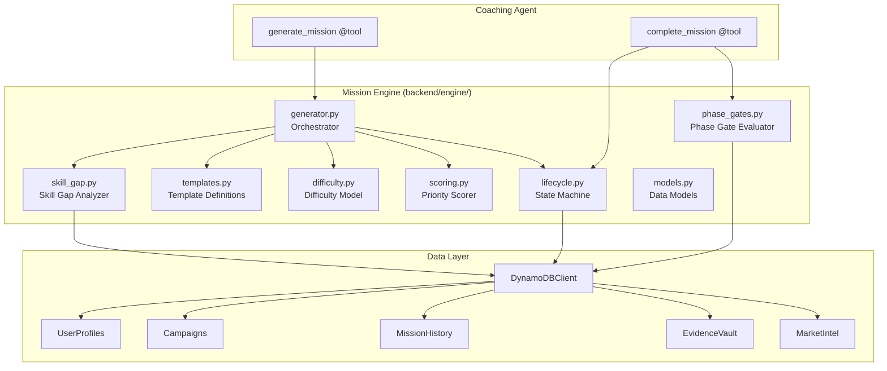
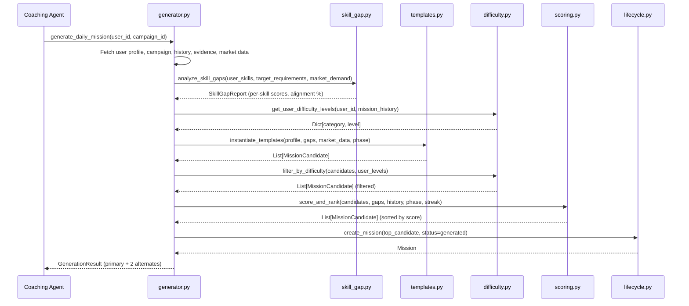
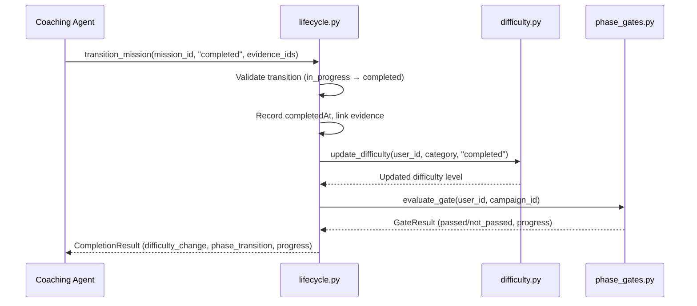

# Design Document: Mission Engine

## Overview

The Mission Engine is a standalone Python package at `backend/engine/` that provides the intelligence layer for REGAIN's daily mission system. It takes user profile data, campaign state, evidence history, and market signals as inputs and produces ranked, personalized, evidence-producing missions. The Coaching Agent's Strands `@tool` functions import and call the engine directly — the engine has no dependency on the agent.

The engine is structured as a pipeline: data gathering → skill gap analysis → template instantiation → difficulty filtering → priority scoring → mission selection. Each stage is a separate module with a clear interface, and the orchestrator (`generator.py`) wires them together.

All DynamoDB access goes through the existing `DynamoDBClient` at `backend/lambda/shared/dynamodb.py`. No new tables are created. The engine adds attributes to existing tables where needed.

## Architecture



### Pipeline Flow (Mission Generation)



### Pipeline Flow (Mission Completion)



## Components and Interfaces

### models.py — Engine Data Models

Defines all engine-specific dataclasses. These are internal to the engine and distinct from the shared platform models.

```python
@dataclass
class MissionCandidate:
    """A scored candidate mission produced by the generation pipeline."""
    template_id: str
    category: str          # "reflection", "skill_building", "portfolio", "networking", "market_research"
    title: str
    description: str
    rationale: str         # Why this mission matters for the user
    skill_tags: list[str]
    difficulty: int        # 1-5
    estimated_minutes: int # 15-45
    expected_evidence_type: str  # "reflection", "artifact", "connection", "research"
    phase: str             # "foundation", "expansion", "launch"
    market_relevance_score: float  # 0.0-1.0
    priority_score: float  # Computed by scorer, 0.0-1.0

@dataclass
class SkillGapReport:
    """Result of skill gap analysis."""
    skill_scores: dict[str, float]       # skill_name → 0.0-1.0
    market_alignment_pct: float          # 0.0-100.0
    priority_skills: list[str]           # Skills sorted by gap * demand, descending
    evidence_density: dict[str, int]     # skill_name → evidence count

@dataclass
class GateResult:
    """Result of a phase gate evaluation."""
    passed: bool
    current_phase: str
    next_phase: str | None               # None if not passed or at final phase
    conditions: dict[str, GateCondition] # condition_name → status

@dataclass
class GateCondition:
    """Status of a single gate condition."""
    required: float | int
    current: float | int
    met: bool

@dataclass
class DifficultyState:
    """Per-category difficulty tracking for a user."""
    levels: dict[str, int]                # category → level (1-5)
    consecutive_completions: dict[str, int]  # category → streak count
    consecutive_skips: dict[str, int]        # category → skip streak count
    last_advancement_dates: dict[str, str]   # category → ISO date of last level-up

@dataclass
class CompletionResult:
    """Result returned after completing a mission."""
    mission_id: str
    difficulty_change: dict[str, int] | None  # category → new level, if changed
    gate_result: GateResult
    behavioral_update: dict[str, Any]

@dataclass
class GenerationResult:
    """Result of the mission generation pipeline."""
    primary: MissionCandidate
    alternates: list[MissionCandidate]  # Exactly 2
    skill_gap_report: SkillGapReport
```

### templates.py — Mission Template Definitions

Stores all mission templates as structured data. Each template is a dataclass with parameterized fields that accept user data to produce personalized `MissionCandidate` instances.

```python
@dataclass
class MissionTemplate:
    """A parameterized mission template."""
    template_id: str
    category: str
    title_template: str       # f-string style: "Reflect on your {skill} experience at {company}"
    description_template: str
    rationale_template: str
    skill_tags: list[str]     # Can include "{target_skill}" placeholders
    difficulty: int
    estimated_minutes: int
    expected_evidence_type: str
    phases: list[str]         # Which phases this template is valid for

def get_all_templates() -> list[MissionTemplate]:
    """Return all registered mission templates."""

def instantiate_template(
    template: MissionTemplate,
    profile: dict[str, Any],
    skill_gaps: SkillGapReport,
    market_data: dict[str, Any],
) -> MissionCandidate:
    """Substitute user data into a template to produce a candidate."""

def instantiate_all_templates(
    profile: dict[str, Any],
    skill_gaps: SkillGapReport,
    market_data: dict[str, Any],
    phase: str,
) -> list[MissionCandidate]:
    """Instantiate all templates valid for the given phase."""
```

### skill_gap.py — Skill Gap Analyzer

```python
def analyze_skill_gaps(
    user_skills: list[str],
    evidence_by_skill: dict[str, list[dict[str, Any]]],
    target_requirements: list[dict[str, Any]],
    market_demand: dict[str, float],
) -> SkillGapReport:
    """Compare user evidence against target role requirements.

    Args:
        user_skills: Skills from user's Transition Profile.
        evidence_by_skill: Evidence records grouped by skill tag.
        target_requirements: Required skills with importance weights from MarketIntel.
        market_demand: Skill name → demand weight (0.0-1.0).

    Returns:
        SkillGapReport with per-skill scores and market alignment.
    """
```

The per-skill score formula:
- `evidence_score = min(1.0, evidence_count * recency_weight / threshold)`
- `recency_weight` decays older evidence (halves every 90 days)
- `threshold` = 3 evidence items for full score
- `skill_score = evidence_score` (capped at 1.0)
- `market_alignment_pct = sum(skill_score[s] * demand[s] for s in target_skills) / sum(demand[s] for s in target_skills) * 100`

### difficulty.py — Difficulty Model

```python
def compute_difficulty_state(
    user_id: str,
    mission_history: list[dict[str, Any]],
) -> DifficultyState:
    """Compute current difficulty levels from mission history.

    Scans mission history to determine per-category levels,
    consecutive completion/skip streaks, and last advancement dates.
    """

def should_advance(state: DifficultyState, category: str) -> bool:
    """Check if a category should advance difficulty.

    Requires 3 consecutive completions AND no advancement in the last 7 days.
    """

def should_regress(state: DifficultyState, category: str) -> bool:
    """Check if a category should regress difficulty.

    Requires 3 consecutive skips.
    """

def update_difficulty(
    state: DifficultyState,
    category: str,
    outcome: str,  # "completed" or "skipped"
    current_date: str,
) -> DifficultyState:
    """Return a new DifficultyState reflecting the outcome."""

def filter_by_difficulty(
    candidates: list[MissionCandidate],
    state: DifficultyState,
) -> list[MissionCandidate]:
    """Filter candidates to those within ±1 of user's level per category."""
```

### scoring.py — Priority Scorer

```python
WEIGHTS = {
    "gap_priority": 0.40,
    "category_balance": 0.20,
    "difficulty_appropriateness": 0.15,
    "phase_alignment": 0.15,
    "streak_momentum": 0.10,
}

def score_candidate(
    candidate: MissionCandidate,
    skill_gaps: SkillGapReport,
    mission_history: list[dict[str, Any]],
    current_phase: str,
    streak_info: dict[str, Any],
    difficulty_state: DifficultyState,
) -> float:
    """Compute the priority score for a single candidate.

    Returns a float between 0.0 and 1.0.
    """

def score_gap_priority(candidate: MissionCandidate, skill_gaps: SkillGapReport) -> float:
    """Score based on how critical the targeted skill gap is. 0.0-1.0."""

def score_category_balance(candidate: MissionCandidate, mission_history: list[dict[str, Any]]) -> float:
    """Score based on category representation balance. 0.0-1.0."""

def score_difficulty_appropriateness(candidate: MissionCandidate, difficulty_state: DifficultyState) -> float:
    """Score based on match between mission and user difficulty level. 0.0-1.0."""

def score_phase_alignment(candidate: MissionCandidate, current_phase: str) -> float:
    """Score based on mission type fit for current phase. 0.0-1.0."""

def score_streak_momentum(candidate: MissionCandidate, streak_info: dict[str, Any]) -> float:
    """Score based on streak state. 0.0-1.0."""

def score_and_rank(
    candidates: list[MissionCandidate],
    skill_gaps: SkillGapReport,
    mission_history: list[dict[str, Any]],
    current_phase: str,
    streak_info: dict[str, Any],
    difficulty_state: DifficultyState,
) -> list[MissionCandidate]:
    """Score all candidates and return sorted by priority_score descending."""
```

### phase_gates.py — Phase Gate Evaluator

```python
GATE_CONDITIONS = {
    "foundation_to_expansion": {
        "min_completed_missions": 10,
        "min_categories": 3,
        "min_unique_skills": 8,
        "min_market_alignment": 40.0,
    },
    "expansion_to_launch": {
        "min_completed_missions": 25,
        "min_categories": 5,
        "min_unique_skills": 15,
        "min_portfolio_artifacts": 3,
        "min_market_alignment": 65.0,
    },
    "launch_completion": {
        "min_completed_missions": 40,
        "min_unique_skills": 20,
        "min_market_alignment": 80.0,
    },
}

def evaluate_gate(
    current_phase: str,
    completed_missions: list[dict[str, Any]],
    evidence_by_skill: dict[str, list[dict[str, Any]]],
    market_alignment_pct: float,
) -> GateResult:
    """Evaluate whether the user meets the gate conditions for the current phase."""
```

### lifecycle.py — Mission State Machine

```python
VALID_TRANSITIONS = {
    "generated": {"assigned"},
    "assigned": {"in_progress", "skipped", "expired"},
    "in_progress": {"completed", "skipped"},
}

def validate_transition(current_status: str, target_status: str) -> bool:
    """Check if a state transition is valid."""

def transition_mission(
    mission: dict[str, Any],
    target_status: str,
    evidence_ids: list[str] | None = None,
    timestamp: str | None = None,
) -> dict[str, Any]:
    """Apply a state transition to a mission dict.

    Returns the updated mission dict with new status and timestamps.
    Raises ValueError if the transition is invalid.
    """

def check_expired_missions(
    missions: list[dict[str, Any]],
    current_time: str,
    expiry_hours: int = 48,
) -> list[dict[str, Any]]:
    """Identify missions that should transition to expired status."""
```

### generator.py — Orchestrator

```python
def generate_daily_mission(
    user_id: str,
    campaign_id: str,
    db: DynamoDBClient | None = None,
) -> GenerationResult:
    """Run the full mission generation pipeline.

    1. Fetch user profile, campaign, mission history, evidence, market data
    2. Compute skill gaps
    3. Compute difficulty state
    4. Instantiate templates for current phase
    5. Filter by difficulty
    6. Exclude recently completed duplicates (14-day window)
    7. Score and rank candidates
    8. Return top 3 (primary + 2 alternates)
    """

def complete_mission(
    user_id: str,
    mission_id: str,
    evidence_ids: list[str],
    db: DynamoDBClient | None = None,
) -> CompletionResult:
    """Handle mission completion: state transition, difficulty update, gate check.

    1. Transition mission to completed
    2. Update difficulty state
    3. Evaluate phase gate
    4. Return completion result with any phase transition
    """
```

## Data Models

### Existing Table Attribute Extensions

The engine adds these attributes to existing DynamoDB items. All are additive — no existing attributes are modified or removed.

**MissionHistory table (additional attributes on mission items):**

| Attribute | Type | Description |
|-----------|------|-------------|
| templateId | String | ID of the template that generated this mission |
| category | String | "reflection", "skill_building", "portfolio", "networking", "market_research" |
| skillTags | List[String] | Skills this mission targets |
| difficulty | Number | Difficulty level 1-5 |
| estimatedMinutes | Number | Expected completion time |
| expectedEvidenceType | String | "reflection", "artifact", "connection", "research" |
| phase | String | Campaign phase when assigned: "foundation", "expansion", "launch" |
| marketRelevanceScore | Number | 0.0-1.0 market relevance at generation time |
| priorityScore | Number | 0.0-1.0 priority score at generation time |
| rationale | String | Why this mission matters for the user |
| assignedAt | String | ISO timestamp when assigned |
| startedAt | String | ISO timestamp when user started |
| completedAt | String | ISO timestamp when completed |
| evidenceIds | List[String] | Linked evidence record IDs |

**Campaigns table (additional attributes):**

| Attribute | Type | Description |
|-----------|------|-------------|
| difficultyState | Map | Serialized DifficultyState: levels, streaks, last advancement dates per category |

### Internal Data Flow

The engine does not define new DynamoDB tables. All data flows through the existing `DynamoDBClient`:

- **Read** from UserProfiles: user skills, target role, persona, experience
- **Read** from Campaigns: current phase, difficulty state, skills focus
- **Read** from MissionHistory: mission history for patterns, streaks, recent completions
- **Read** from EvidenceVault: evidence records grouped by skill for gap analysis
- **Read** from MarketIntel: skill demand, role requirements for target sector
- **Write** to MissionHistory: new mission records with extended attributes
- **Write** to Campaigns: updated difficulty state, phase transitions


## Correctness Properties

*A property is a characteristic or behavior that should hold true across all valid executions of a system — essentially, a formal statement about what the system should do. Properties serve as the bridge between human-readable specifications and machine-verifiable correctness guarantees.*

### Property 1: Template instantiation produces valid candidates

*For any* mission template and any valid user profile data (with non-empty skills, target role, and experience), instantiating the template shall produce a MissionCandidate where: all required fields are non-empty (title, description, rationale, skill_tags, expected_evidence_type), no raw placeholder strings remain in the title or description, difficulty is between 1 and 5, and estimated_minutes is between 15 and 45.

**Validates: Requirements 1.2, 1.3, 1.4**

### Property 2: Skill gap scores bounded

*For any* combination of user evidence records and market demand data, every per-skill score in the resulting SkillGapReport shall be between 0.0 and 1.0 inclusive.

**Validates: Requirements 2.2**

### Property 3: Market alignment is correct weighted average

*For any* set of per-skill scores and market demand weights, the market_alignment_pct shall equal `sum(score[s] * demand[s] for s in skills) / sum(demand[s] for s in skills) * 100`, within a floating-point tolerance of 0.01.

**Validates: Requirements 2.3**

### Property 4: Difficulty levels bounded

*For any* DifficultyState produced by compute_difficulty_state or update_difficulty, all category levels shall be between 1 and 5 inclusive.

**Validates: Requirements 3.1**

### Property 5: Difficulty advances after 3 consecutive completions

*For any* category at level L < 5 with 3 consecutive completions and no advancement in the last 7 days, calling update_difficulty with outcome "completed" shall produce a DifficultyState where that category's level is L + 1.

**Validates: Requirements 3.3**

### Property 6: Difficulty regresses after 3 consecutive skips

*For any* category at level L > 1 with 3 consecutive skips, calling update_difficulty with outcome "skipped" shall produce a DifficultyState where that category's level is L - 1.

**Validates: Requirements 3.4**

### Property 7: Difficulty advancement capped at 1 per 7 days

*For any* category that was advanced within the last 7 days, should_advance shall return False regardless of the consecutive completion count.

**Validates: Requirements 3.5**

### Property 8: Priority score equals weighted sum of sub-scores

*For any* MissionCandidate and scoring inputs, the computed priority_score shall equal `0.40 * gap_priority + 0.20 * category_balance + 0.15 * difficulty_appropriateness + 0.15 * phase_alignment + 0.10 * streak_momentum`, within a floating-point tolerance of 0.001.

**Validates: Requirements 4.1**

### Property 9: Gap priority monotonic with gap width and demand

*For any* two MissionCandidates where candidate A targets a skill with a wider gap and higher market demand than candidate B, the gap_priority sub-score of A shall be greater than or equal to that of B.

**Validates: Requirements 4.2**

### Property 10: Category balance penalizes overindexed categories

*For any* mission history where category X has more completed missions than category Y, a candidate in category X shall have a lower category_balance sub-score than a candidate in category Y.

**Validates: Requirements 4.3**

### Property 11: Difficulty appropriateness peaks at matching level

*For any* user difficulty level L in a category, a candidate at difficulty L shall have a higher difficulty_appropriateness sub-score than a candidate at difficulty L+1 or L-1 in the same category.

**Validates: Requirements 4.4**

### Property 12: Phase alignment favors phase-appropriate categories

*For any* campaign phase, a candidate in a phase-preferred category shall have a higher phase_alignment sub-score than a candidate in a non-preferred category. Preferred mappings: Foundation → {reflection, skill_building}, Expansion → {portfolio, market_research}, Launch → {networking}.

**Validates: Requirements 4.5**

### Property 13: Streak momentum adapts to streak state

*For any* user on a completion streak, a candidate similar to recent completions shall score higher on streak_momentum than a dissimilar candidate. *For any* user with a broken streak, an easier candidate shall score higher on streak_momentum than a harder one.

**Validates: Requirements 4.6**

### Property 14: Top candidate selected as primary

*For any* list of 3 or more scored MissionCandidates, the GenerationResult's primary mission shall have the highest priority_score, and the 2 alternates shall have the next two highest scores.

**Validates: Requirements 4.7**

### Property 15: Gate evaluation correct for all phases

*For any* phase and mission/evidence data, the gate passes if and only if all conditions for that phase are met. When the gate fails, every condition in the GateResult has accurate current values and correct met/not-met status.

**Validates: Requirements 5.1, 5.2, 5.3, 5.6**

### Property 16: State transitions match valid transition map

*For any* mission in state S and target state T, the transition succeeds if and only if T is in the valid transitions set for S. Invalid transitions raise ValueError.

**Validates: Requirements 6.1, 6.2**

### Property 17: Transitions produce correct timestamps and linked data

*For any* valid transition to "assigned", the resulting mission has an assignedAt timestamp. *For any* valid transition to "completed", the resulting mission has a completedAt timestamp and evidenceIds linked.

**Validates: Requirements 6.3, 6.4**

### Property 18: Expiry detection for 48-hour assigned missions

*For any* mission in "assigned" status where the elapsed time since assignedAt exceeds 48 hours, check_expired_missions shall include that mission. *For any* assigned mission where elapsed time is under 48 hours, it shall not be included.

**Validates: Requirements 6.5**

### Property 19: Recent duplicate exclusion

*For any* set of MissionCandidates and a mission history, candidates whose template_id and primary skill_tag match a mission completed within the last 14 days shall be excluded from the generation result.

**Validates: Requirements 7.5**

## Error Handling

### Input Validation

- **Missing user profile**: If the user profile is not found in DynamoDB, `generate_daily_mission` returns an error result with a descriptive message. No mission is generated.
- **Missing campaign**: If no active campaign exists, return an error result. The Coaching Agent should prompt campaign creation first.
- **Empty market data**: If no market data exists for the user's target sector, the engine falls back to equal demand weights across all skills (demand = 1.0 for all). Mission generation proceeds without market-weighted prioritization.
- **Insufficient templates**: If fewer than 3 candidates survive filtering, the engine relaxes the difficulty filter (±2 instead of ±1) and retries. If still insufficient, return all available candidates with a warning.

### State Machine Errors

- **Invalid transition**: `transition_mission` raises `ValueError` with a message specifying the current state and invalid target state.
- **Mission not found**: Operations on non-existent missions return an error dict with `error: "not_found"`.

### Data Integrity

- **Concurrent modifications**: The engine uses DynamoDB conditional writes where state transitions are involved (e.g., only transition if current status matches expected). This prevents race conditions between the agent and expiry checks.
- **Partial failures**: If evidence linking succeeds but difficulty update fails, the mission is still marked completed. Difficulty state is recomputed from history on next generation, so transient failures self-heal.

### Graceful Degradation

- **DynamoDB throttling**: The engine does not implement retries — the existing DynamoDBClient and boto3 handle this. If a read fails, the generation pipeline returns an error rather than generating with incomplete data.
- **Clock skew**: All timestamps use UTC ISO format. Expiry checks use a 48-hour window which is tolerant of minor clock differences.

## Testing Strategy

### Dual Testing Approach

The engine uses both unit tests and property-based tests:

- **Property-based tests** (Hypothesis): Validate universal properties across randomly generated inputs. Each property from the Correctness Properties section becomes a single Hypothesis test. Minimum 100 examples per test.
- **Unit tests** (pytest): Validate specific examples, edge cases, and integration points. Focus on: empty inputs, boundary values, error conditions, and the orchestrator wiring.

### Property-Based Testing Configuration

- Library: **Hypothesis** (already in project dependencies)
- Runner: **pytest** with `hypothesis` plugin
- Minimum iterations: 100 per property (Hypothesis default is 100)
- Each test tagged with: `# Feature: mission-engine, Property N: <property_text>`
- Each correctness property maps to exactly one Hypothesis test function
- Custom Hypothesis strategies for generating: MissionCandidates, SkillGapReports, DifficultyStates, mission histories

### Unit Test Focus

- Orchestrator (`generator.py`): Test with mocked DynamoDB data to verify pipeline wiring
- Edge cases: empty mission history, single skill, all skills at max evidence, all categories at max difficulty
- Error paths: missing profile, missing campaign, invalid transitions
- Template instantiation with known inputs to verify output content

### Test Location

All tests at `tests/unit/engine/` mirroring the engine module structure:
- `tests/unit/engine/test_templates.py`
- `tests/unit/engine/test_skill_gap.py`
- `tests/unit/engine/test_difficulty.py`
- `tests/unit/engine/test_scoring.py`
- `tests/unit/engine/test_phase_gates.py`
- `tests/unit/engine/test_lifecycle.py`
- `tests/unit/engine/test_generator.py`
