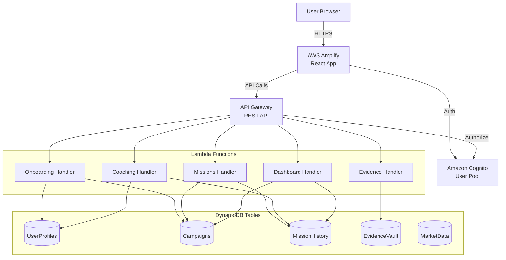
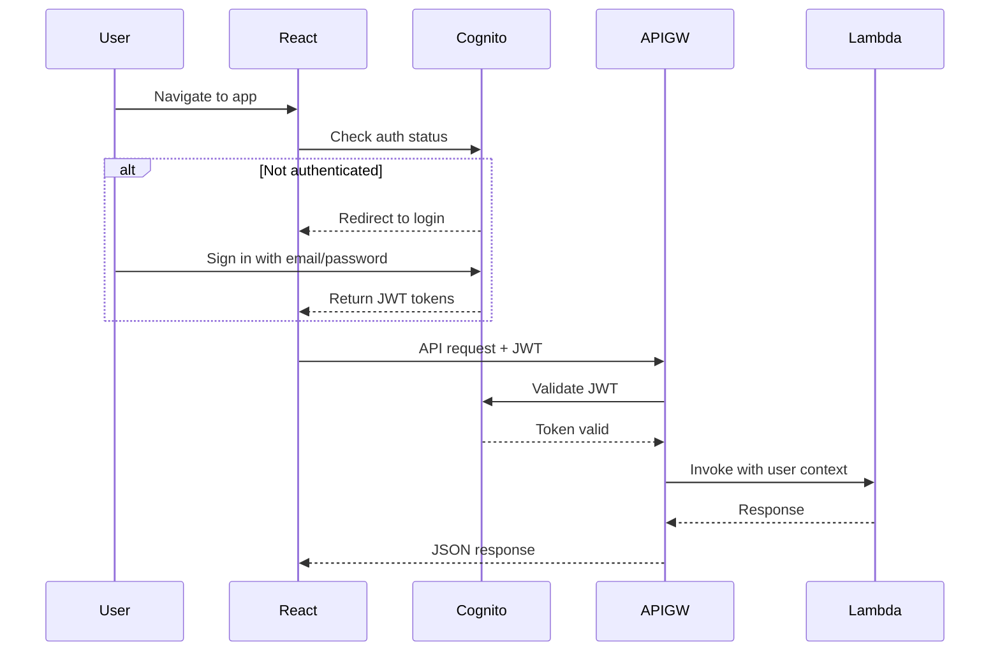

# Design Document: Platform Foundation

## Overview

The REGAIN platform foundation establishes the core infrastructure for an AI-powered reskilling platform. This design covers:

1. **Infrastructure as Code**: AWS CDK project structure with Python-based stack definitions
2. **Authentication**: Amazon Cognito User Pool for secure user management
3. **Data Layer**: Five DynamoDB tables with appropriate indexes for access patterns
4. **API Layer**: REST API Gateway with Lambda functions following thin-handler pattern
5. **Frontend Shell**: React + TypeScript application with routing, auth, and API integration
6. **Shared Utilities**: Reusable Python modules for DynamoDB access and common operations

This foundation is designed to operate within AWS Free Tier limits while supporting future features like adaptive coaching agents, mission engines, and market intelligence.

## Architecture

### High-Level Architecture



### CDK Stack Organization

The infrastructure is organized into three independent CDK stacks:

1. **RegainAuthStack**: Cognito User Pool and client configuration
2. **RegainDataStack**: All DynamoDB tables with GSIs
3. **RegainApiStack**: API Gateway, Lambda functions, and IAM roles

Cross-stack references use CloudFormation exports (CfnOutput) to share resource identifiers.

### Authentication Flow



### Data Access Pattern

All Lambda functions follow the thin-handler pattern:

```
API Request → Lambda Handler → Service Module → Data Access Layer → DynamoDB
```

This separation ensures:
- Handlers contain no business logic
- Service modules are testable without AWS dependencies
- DynamoDB access is centralized and consistent


## Components and Interfaces

### 1. CDK Application (infra/app.py)

**Purpose**: Entry point for AWS CDK that instantiates and synthesizes all stacks.

**Interface**:
```python
#!/usr/bin/env python3
import aws_cdk as cdk
from stacks.auth_stack import AuthStack
from stacks.data_stack import DataStack
from stacks.api_stack import ApiStack

app = cdk.App()

# Stack instantiation with cross-stack references
auth_stack = AuthStack(app, "RegainAuthStack", env=env)
data_stack = DataStack(app, "RegainDataStack", env=env)
api_stack = ApiStack(app, "RegainApiStack", 
                     user_pool=auth_stack.user_pool,
                     tables=data_stack.tables,
                     env=env)

app.synth()
```

**Configuration**:
- Environment: us-east-1 (for AgentCore availability)
- Account: 563170906428
- Tags applied to all resources: Project=REGAIN, Environment=dev

### 2. Authentication Stack (infra/stacks/auth_stack.py)

**Purpose**: Manages Cognito User Pool for authentication.

**Resources**:
- Cognito User Pool with email sign-in
- User Pool Client (SRP auth, no client secret)
- Email verification enabled

**Exports**:
```python
CfnOutput(self, "UserPoolId", 
          value=self.user_pool.user_pool_id,
          export_name="RegainUserPoolId")

CfnOutput(self, "UserPoolClientId",
          value=self.user_pool_client.user_pool_client_id,
          export_name="RegainUserPoolClientId")
```

**Configuration**:
- Password policy: minimum 8 characters, requires uppercase, lowercase, numbers
- MFA: optional (not required for MVP)
- Account recovery: email only


### 3. Data Stack (infra/stacks/data_stack.py)

**Purpose**: Creates all DynamoDB tables with appropriate indexes.

**Tables and Access Patterns**:

#### UserProfiles Table
- **Primary Key**: userId (string)
- **Attributes**: email, name, persona, onboarding_completed, created_at
- **Access Pattern**: Get user profile by userId

#### Campaigns Table
- **Primary Key**: userId (string), campaignId (string)
- **GSI**: status-index (partition: status, sort: userId)
- **Attributes**: title, phase, status, start_date, target_role, skills_focus
- **Access Patterns**:
  - Get all campaigns for a user
  - Query active campaigns across all users (for admin/analytics)

#### MissionHistory Table
- **Primary Key**: userId (string), missionId (string)
- **GSI-1**: status-index (partition: status, sort: userId)
- **GSI-2**: date-index (partition: userId, sort: completed_date)
- **Attributes**: campaign_id, title, description, status, completed_date, evidence_id
- **Access Patterns**:
  - Get all missions for a user
  - Get missions by status
  - Get missions sorted by completion date

#### EvidenceVault Table
- **Primary Key**: userId (string), evidenceId (string)
- **GSI**: skill-index (partition: skill_tag, sort: created_at)
- **Attributes**: mission_id, skill_tag, artifact_url, reflection, created_at
- **Access Patterns**:
  - Get all evidence for a user
  - Query evidence by skill tag

#### MarketData Table
- **Primary Key**: sector (string), timestamp (string)
- **Attributes**: job_trends, skill_demand, salary_ranges, data_source
- **Access Patterns**:
  - Get latest market data for a sector
  - Query historical trends for a sector

**Billing Mode**: All tables use on-demand capacity (PAY_PER_REQUEST) to stay within free tier.

**Exports**:
```python
for table_name, table in self.tables.items():
    CfnOutput(self, f"{table_name}Name",
              value=table.table_name,
              export_name=f"Regain{table_name}Name")
    CfnOutput(self, f"{table_name}Arn",
              value=table.table_arn,
              export_name=f"Regain{table_name}Arn")
```


### 4. API Stack (infra/stacks/api_stack.py)

**Purpose**: Creates REST API with Lambda functions and Cognito authorization.

**API Gateway Configuration**:
- REST API with Cognito authorizer
- CORS enabled for frontend domain
- Request validation enabled
- CloudWatch logging for all requests

**Lambda Functions**:

Each Lambda function follows this structure:
```
backend/lambda/{function_name}/
├── handler.py          # Lambda entry point
├── service.py          # Business logic
└── requirements.txt    # Dependencies
```

#### POST /onboarding
- **Handler**: backend/lambda/onboarding/handler.py
- **Purpose**: Create user profile and initialize campaign
- **Input**: { email, name, persona, target_role, skills }
- **Output**: { userId, campaignId, profile }
- **DynamoDB Access**: UserProfiles (write), Campaigns (write)

#### GET /missions
- **Handler**: backend/lambda/missions/handler.py
- **Purpose**: Retrieve current mission for authenticated user
- **Input**: Query params: status (optional)
- **Output**: { missions: [...] }
- **DynamoDB Access**: MissionHistory (read), Campaigns (read)

#### POST /missions/{missionId}/complete
- **Handler**: backend/lambda/missions/handler.py
- **Purpose**: Mark mission complete and log evidence
- **Input**: { reflection, artifact_url, skill_tags }
- **Output**: { success, evidence_id }
- **DynamoDB Access**: MissionHistory (write), EvidenceVault (write)

#### GET /evidence
- **Handler**: backend/lambda/evidence/handler.py
- **Purpose**: Retrieve evidence vault for authenticated user
- **Input**: Query params: skill_tag (optional)
- **Output**: { evidence: [...] }
- **DynamoDB Access**: EvidenceVault (read)

#### POST /coaching/checkin
- **Handler**: backend/lambda/coaching/handler.py
- **Purpose**: Trigger coaching check-in (placeholder for future agent integration)
- **Input**: { message }
- **Output**: { response }
- **DynamoDB Access**: UserProfiles (read), MissionHistory (read)

#### GET /dashboard
- **Handler**: backend/lambda/dashboard/handler.py
- **Purpose**: Retrieve campaign progress and statistics
- **Input**: None (uses authenticated userId)
- **Output**: { campaign, stats: { missions_completed, evidence_count, current_phase } }
- **DynamoDB Access**: Campaigns (read), MissionHistory (read), EvidenceVault (read)

**IAM Permissions**:
Each Lambda gets least-privilege access:
```python
table.grant_read_data(lambda_function)      # For read operations
table.grant_write_data(lambda_function)     # For write operations
table.grant_read_write_data(lambda_function) # For both
```


### 5. Shared Utilities (backend/lambda/shared/)

**Purpose**: Provide reusable modules for all Lambda functions.

**Module Structure**:
```
backend/lambda/shared/
├── __init__.py
├── dynamodb.py         # Data access layer
├── responses.py        # API response helpers
├── config.py           # Environment configuration
└── models.py           # Data models and validation
```

#### dynamodb.py - Data Access Layer

```python
from typing import Dict, List, Optional, Any
import boto3
import os
from boto3.dynamodb.conditions import Key, Attr

class DynamoDBClient:
    """Centralized DynamoDB access layer."""
    
    def __init__(self):
        self.dynamodb = boto3.resource('dynamodb')
        self.tables = {
            'user_profiles': self.dynamodb.Table(os.environ['USER_PROFILES_TABLE']),
            'campaigns': self.dynamodb.Table(os.environ['CAMPAIGNS_TABLE']),
            'mission_history': self.dynamodb.Table(os.environ['MISSION_HISTORY_TABLE']),
            'evidence_vault': self.dynamodb.Table(os.environ['EVIDENCE_VAULT_TABLE']),
            'market_data': self.dynamodb.Table(os.environ['MARKET_DATA_TABLE'])
        }
    
    def get_item(self, table_name: str, key: Dict[str, Any]) -> Optional[Dict]:
        """Get single item by primary key."""
        
    def put_item(self, table_name: str, item: Dict[str, Any]) -> Dict:
        """Put item into table."""
        
    def query(self, table_name: str, key_condition: Any, 
              index_name: Optional[str] = None) -> List[Dict]:
        """Query table or GSI."""
        
    def update_item(self, table_name: str, key: Dict[str, Any], 
                    updates: Dict[str, Any]) -> Dict:
        """Update item attributes."""
```

#### responses.py - Response Helpers

```python
from typing import Dict, Any, Optional
import json

def success_response(data: Dict[str, Any], status_code: int = 200) -> Dict:
    """Return successful API response."""
    return {
        'statusCode': status_code,
        'headers': {
            'Content-Type': 'application/json',
            'Access-Control-Allow-Origin': '*'
        },
        'body': json.dumps(data)
    }

def error_response(message: str, status_code: int = 400) -> Dict:
    """Return error API response."""
    return {
        'statusCode': status_code,
        'headers': {
            'Content-Type': 'application/json',
            'Access-Control-Allow-Origin': '*'
        },
        'body': json.dumps({'error': message})
    }
```

#### config.py - Environment Configuration

```python
import os

class Config:
    """Environment configuration."""
    
    USER_PROFILES_TABLE = os.environ.get('USER_PROFILES_TABLE')
    CAMPAIGNS_TABLE = os.environ.get('CAMPAIGNS_TABLE')
    MISSION_HISTORY_TABLE = os.environ.get('MISSION_HISTORY_TABLE')
    EVIDENCE_VAULT_TABLE = os.environ.get('EVIDENCE_VAULT_TABLE')
    MARKET_DATA_TABLE = os.environ.get('MARKET_DATA_TABLE')
    REGION = os.environ.get('AWS_REGION', 'us-east-1')
```


### 6. Frontend Shell (frontend/)

**Purpose**: React application with authentication and API integration.

**Technology Stack**:
- Vite (build tool)
- React 18 with TypeScript
- React Router v6
- AWS Amplify Auth
- Tailwind CSS

**Project Structure**:
```
frontend/
├── src/
│   ├── main.tsx                 # App entry point
│   ├── App.tsx                  # Root component with router
│   ├── components/
│   │   ├── Layout.tsx           # Navigation sidebar
│   │   ├── ProtectedRoute.tsx   # Auth wrapper
│   │   └── Login.tsx            # Login form
│   ├── pages/
│   │   ├── Onboarding.tsx       # Onboarding flow
│   │   ├── Dashboard.tsx        # Campaign overview
│   │   ├── Missions.tsx         # Mission list
│   │   ├── Evidence.tsx         # Evidence vault
│   │   └── Profile.tsx          # User profile
│   ├── hooks/
│   │   ├── useAuth.tsx          # Authentication hook
│   │   ├── useOnboarding.ts     # Onboarding API hook
│   │   ├── useMissions.ts       # Missions API hook
│   │   └── useEvidence.ts       # Evidence API hook
│   ├── services/
│   │   └── api.ts               # API client layer
│   └── types/
│       └── index.ts             # TypeScript types
├── package.json
├── tsconfig.json
├── vite.config.ts
└── tailwind.config.js
```

#### Authentication Context (hooks/useAuth.tsx)

```typescript
import { createContext, useContext, useEffect, useState } from 'react';
import { Amplify } from 'aws-amplify';
import { signIn, signOut, getCurrentUser, fetchAuthSession } from 'aws-amplify/auth';

interface AuthContextType {
  user: any | null;
  loading: boolean;
  signIn: (email: string, password: string) => Promise<void>;
  signOut: () => Promise<void>;
  getToken: () => Promise<string>;
}

const AuthContext = createContext<AuthContextType | undefined>(undefined);

export function AuthProvider({ children }: { children: React.ReactNode }) {
  const [user, setUser] = useState<any | null>(null);
  const [loading, setLoading] = useState(true);
  
  // Implementation details...
}

export function useAuth() {
  const context = useContext(AuthContext);
  if (!context) throw new Error('useAuth must be used within AuthProvider');
  return context;
}
```


#### API Client Layer (services/api.ts)

```typescript
import { useAuth } from '../hooks/useAuth';

const API_BASE_URL = import.meta.env.VITE_API_URL;

interface ApiRequestOptions {
  method: 'GET' | 'POST' | 'PUT' | 'DELETE';
  body?: any;
  headers?: Record<string, string>;
}

async function apiRequest<T>(
  endpoint: string, 
  options: ApiRequestOptions,
  token: string
): Promise<T> {
  const response = await fetch(`${API_BASE_URL}${endpoint}`, {
    method: options.method,
    headers: {
      'Content-Type': 'application/json',
      'Authorization': `Bearer ${token}`,
      ...options.headers
    },
    body: options.body ? JSON.stringify(options.body) : undefined
  });
  
  if (!response.ok) {
    throw new Error(`API error: ${response.statusText}`);
  }
  
  return response.json();
}

// Typed API functions
export const api = {
  onboarding: {
    create: (data: OnboardingData, token: string) => 
      apiRequest<OnboardingResponse>('/onboarding', { method: 'POST', body: data }, token)
  },
  missions: {
    list: (token: string) => 
      apiRequest<MissionsResponse>('/missions', { method: 'GET' }, token),
    complete: (missionId: string, data: CompleteData, token: string) =>
      apiRequest<CompleteResponse>(`/missions/${missionId}/complete`, { method: 'POST', body: data }, token)
  },
  evidence: {
    list: (token: string, skillTag?: string) =>
      apiRequest<EvidenceResponse>(`/evidence${skillTag ? `?skill_tag=${skillTag}` : ''}`, { method: 'GET' }, token)
  },
  dashboard: {
    get: (token: string) =>
      apiRequest<DashboardResponse>('/dashboard', { method: 'GET' }, token)
  }
};
```

#### Protected Route Component

```typescript
import { Navigate } from 'react-router-dom';
import { useAuth } from '../hooks/useAuth';

export function ProtectedRoute({ children }: { children: React.ReactNode }) {
  const { user, loading } = useAuth();
  
  if (loading) {
    return <div>Loading...</div>;
  }
  
  if (!user) {
    return <Navigate to="/login" replace />;
  }
  
  return <>{children}</>;
}
```

#### Router Configuration (App.tsx)

```typescript
import { BrowserRouter, Routes, Route } from 'react-router-dom';
import { AuthProvider } from './hooks/useAuth';
import { ProtectedRoute } from './components/ProtectedRoute';
import Layout from './components/Layout';
import Login from './components/Login';
import Onboarding from './pages/Onboarding';
import Dashboard from './pages/Dashboard';
import Missions from './pages/Missions';
import Evidence from './pages/Evidence';
import Profile from './pages/Profile';

function App() {
  return (
    <AuthProvider>
      <BrowserRouter>
        <Routes>
          <Route path="/login" element={<Login />} />
          <Route path="/" element={
            <ProtectedRoute>
              <Layout />
            </ProtectedRoute>
          }>
            <Route path="onboarding" element={<Onboarding />} />
            <Route path="dashboard" element={<Dashboard />} />
            <Route path="missions" element={<Missions />} />
            <Route path="evidence" element={<Evidence />} />
            <Route path="profile" element={<Profile />} />
          </Route>
        </Routes>
      </BrowserRouter>
    </AuthProvider>
  );
}
```


## Data Models

### UserProfile

```python
from typing import Optional
from datetime import datetime
from dataclasses import dataclass

@dataclass
class UserProfile:
    user_id: str
    email: str
    name: str
    persona: str  # 'veteran', 'ai_displaced', 'career_pivoter'
    onboarding_completed: bool
    created_at: str
    target_role: Optional[str] = None
    skills: Optional[list[str]] = None
    
    def to_dynamodb_item(self) -> dict:
        """Convert to DynamoDB item format."""
        return {
            'userId': self.user_id,
            'email': self.email,
            'name': self.name,
            'persona': self.persona,
            'onboardingCompleted': self.onboarding_completed,
            'createdAt': self.created_at,
            'targetRole': self.target_role,
            'skills': self.skills or []
        }
    
    @classmethod
    def from_dynamodb_item(cls, item: dict) -> 'UserProfile':
        """Create from DynamoDB item."""
        return cls(
            user_id=item['userId'],
            email=item['email'],
            name=item['name'],
            persona=item['persona'],
            onboarding_completed=item['onboardingCompleted'],
            created_at=item['createdAt'],
            target_role=item.get('targetRole'),
            skills=item.get('skills', [])
        )
```

### Campaign

```python
@dataclass
class Campaign:
    user_id: str
    campaign_id: str
    title: str
    phase: str  # 'foundation', 'momentum', 'acceleration', 'transition'
    status: str  # 'active', 'paused', 'completed'
    start_date: str
    target_role: str
    skills_focus: list[str]
    
    def to_dynamodb_item(self) -> dict:
        return {
            'userId': self.user_id,
            'campaignId': self.campaign_id,
            'title': self.title,
            'phase': self.phase,
            'status': self.status,
            'startDate': self.start_date,
            'targetRole': self.target_role,
            'skillsFocus': self.skills_focus
        }
```

### Mission

```python
@dataclass
class Mission:
    user_id: str
    mission_id: str
    campaign_id: str
    title: str
    description: str
    status: str  # 'pending', 'in_progress', 'completed', 'skipped'
    completed_date: Optional[str] = None
    evidence_id: Optional[str] = None
    
    def to_dynamodb_item(self) -> dict:
        return {
            'userId': self.user_id,
            'missionId': self.mission_id,
            'campaignId': self.campaign_id,
            'title': self.title,
            'description': self.description,
            'status': self.status,
            'completedDate': self.completed_date,
            'evidenceId': self.evidence_id
        }
```

### Evidence

```python
@dataclass
class Evidence:
    user_id: str
    evidence_id: str
    mission_id: str
    skill_tag: str
    artifact_url: Optional[str]
    reflection: str
    created_at: str
    
    def to_dynamodb_item(self) -> dict:
        return {
            'userId': self.user_id,
            'evidenceId': self.evidence_id,
            'missionId': self.mission_id,
            'skillTag': self.skill_tag,
            'artifactUrl': self.artifact_url,
            'reflection': self.reflection,
            'createdAt': self.created_at
        }
```

### TypeScript Types (frontend/src/types/index.ts)

```typescript
export interface UserProfile {
  userId: string;
  email: string;
  name: string;
  persona: 'veteran' | 'ai_displaced' | 'career_pivoter';
  onboardingCompleted: boolean;
  createdAt: string;
  targetRole?: string;
  skills?: string[];
}

export interface Campaign {
  userId: string;
  campaignId: string;
  title: string;
  phase: 'foundation' | 'momentum' | 'acceleration' | 'transition';
  status: 'active' | 'paused' | 'completed';
  startDate: string;
  targetRole: string;
  skillsFocus: string[];
}

export interface Mission {
  userId: string;
  missionId: string;
  campaignId: string;
  title: string;
  description: string;
  status: 'pending' | 'in_progress' | 'completed' | 'skipped';
  completedDate?: string;
  evidenceId?: string;
}

export interface Evidence {
  userId: string;
  evidenceId: string;
  missionId: string;
  skillTag: string;
  artifactUrl?: string;
  reflection: string;
  createdAt: string;
}
```


## Correctness Properties

A property is a characteristic or behavior that should hold true across all valid executions of a system—essentially, a formal statement about what the system should do. Properties serve as the bridge between human-readable specifications and machine-verifiable correctness guarantees.

### Property 1: CDK Synthesis Validity

*For any* CDK stack in the application, when synthesized, it should produce valid CloudFormation templates that pass AWS CloudFormation validation.

**Validates: Requirements 1.3**

### Property 2: Resource Tagging Consistency

*For all* AWS resources created by the CDK application, each resource should have tags with Project=REGAIN and Environment=dev.

**Validates: Requirements 1.4, 8.5, 8.6**

### Property 3: Environment-Based Table Configuration

*For any* DynamoDB operation in the data access layer, the table name should be read from environment variables rather than hardcoded.

**Validates: Requirements 3.2**

### Property 4: On-Demand Billing Mode

*For all* DynamoDB tables created by the Data Stack, each table should use on-demand (PAY_PER_REQUEST) billing mode.

**Validates: Requirements 5.10, 9.1, 9.4**

### Property 5: Table Output Completeness

*For all* DynamoDB tables created by the Data Stack, the CloudFormation template should export both the table name and table ARN.

**Validates: Requirements 5.11, 5.12**

### Property 6: API Authorization Enforcement

*For all* API Gateway endpoints (excluding public endpoints like login), each endpoint should have the Cognito authorizer attached to validate JWT tokens.

**Validates: Requirements 6.8**

### Property 7: Lambda Runtime Consistency

*For all* Lambda functions created by the API Stack, each function should use Python 3.12 runtime.

**Validates: Requirements 6.9, 9.2**

### Property 8: Lambda Environment Configuration

*For all* Lambda functions that access DynamoDB, each function should receive table names via environment variables.

**Validates: Requirements 6.10**

### Property 9: Least-Privilege IAM Permissions

*For all* Lambda functions, each function's IAM role should only grant permissions to the specific DynamoDB tables it needs to access, not all tables.

**Validates: Requirements 6.11**

### Property 10: Thin Handler Pattern

*For any* Lambda handler function, it should follow the pattern: validate input → call service module → return response, with no business logic in the handler itself.

**Validates: Requirements 6.12**

### Property 11: Protected Route Authentication

*For any* protected route in the React application, when accessed without authentication, it should redirect the user to the login page.

**Validates: Requirements 7.5**

### Property 12: API Request Authentication

*For all* API client functions in the frontend service layer, each function should include the Authorization header with the JWT token.

**Validates: Requirements 7.8**

### Property 13: Resource Naming Convention

*For all* AWS resources created by the CDK application, each resource name should be prefixed with "Regain".

**Validates: Requirements 8.4**

### Property 14: Handler Test Verification

*For any* Lambda handler unit test, the test should mock the service module and verify that the handler calls the service module with the correct parameters.

**Validates: Requirements 10.2**

### Property 15: AWS SDK Mocking

*For all* unit tests that interact with AWS services, each test should use moto or pytest fixtures to mock AWS SDK calls rather than making real API calls.

**Validates: Requirements 10.4**


## Error Handling

### CDK Stack Errors

**Synthesis Errors**:
- Invalid resource configurations should fail at synthesis time with clear error messages
- Missing cross-stack references should be caught during synthesis
- Invalid IAM permissions should be detected before deployment

**Deployment Errors**:
- CloudFormation rollback on any resource creation failure
- Clear error messages for quota limits (e.g., DynamoDB table limits)
- Validation of required environment variables before stack creation

### Lambda Function Errors

**Input Validation**:
```python
def validate_onboarding_input(event: dict) -> tuple[bool, Optional[str]]:
    """Validate onboarding request input.
    
    Returns:
        (is_valid, error_message)
    """
    required_fields = ['email', 'name', 'persona', 'target_role']
    
    for field in required_fields:
        if field not in event.get('body', {}):
            return False, f"Missing required field: {field}"
    
    persona = event['body'].get('persona')
    if persona not in ['veteran', 'ai_displaced', 'career_pivoter']:
        return False, f"Invalid persona: {persona}"
    
    return True, None
```

**DynamoDB Errors**:
- Handle `ConditionalCheckFailedException` for concurrent updates
- Handle `ResourceNotFoundException` for missing tables
- Handle `ProvisionedThroughputExceededException` (should not occur with on-demand, but handle gracefully)
- Log all DynamoDB errors with context (table name, operation, key)

**Response Format**:
```python
# Success response
{
    'statusCode': 200,
    'body': json.dumps({'data': result})
}

# Client error (4xx)
{
    'statusCode': 400,
    'body': json.dumps({'error': 'Invalid input: missing email'})
}

# Server error (5xx)
{
    'statusCode': 500,
    'body': json.dumps({'error': 'Internal server error'})
}
```

### Frontend Error Handling

**API Request Errors**:
```typescript
async function apiRequest<T>(endpoint: string, options: ApiRequestOptions, token: string): Promise<T> {
  try {
    const response = await fetch(`${API_BASE_URL}${endpoint}`, {
      method: options.method,
      headers: {
        'Content-Type': 'application/json',
        'Authorization': `Bearer ${token}`,
        ...options.headers
      },
      body: options.body ? JSON.stringify(options.body) : undefined
    });
    
    if (!response.ok) {
      const errorData = await response.json().catch(() => ({ error: response.statusText }));
      throw new ApiError(errorData.error || 'Request failed', response.status);
    }
    
    return response.json();
  } catch (error) {
    if (error instanceof ApiError) {
      throw error;
    }
    throw new ApiError('Network error', 0);
  }
}

class ApiError extends Error {
  constructor(message: string, public statusCode: number) {
    super(message);
    this.name = 'ApiError';
  }
}
```

**Authentication Errors**:
- Handle expired JWT tokens by refreshing or redirecting to login
- Handle invalid credentials with clear user feedback
- Handle network errors during authentication gracefully

**User Feedback**:
- Display error messages in a toast/notification component
- Provide actionable error messages (e.g., "Please check your email format")
- Log errors to console for debugging (in development mode only)


## Testing Strategy

### Dual Testing Approach

The platform foundation uses both unit tests and property-based tests to ensure comprehensive coverage:

- **Unit tests**: Verify specific examples, edge cases, and error conditions
- **Property tests**: Verify universal properties across all inputs

Both approaches are complementary and necessary. Unit tests catch concrete bugs in specific scenarios, while property tests verify general correctness across a wide range of inputs.

### Unit Testing

**Focus Areas**:
- Specific examples that demonstrate correct behavior
- Integration points between components
- Edge cases and error conditions
- Lambda handler structure (thin-handler pattern)

**Testing Framework**: pytest with moto for AWS service mocking

**Example Unit Test**:
```python
# tests/unit/lambda/test_onboarding_handler.py
import pytest
from unittest.mock import Mock, patch
from backend.lambda.onboarding.handler import lambda_handler
from backend.lambda.onboarding.service import OnboardingService

@pytest.fixture
def mock_service():
    with patch('backend.lambda.onboarding.handler.OnboardingService') as mock:
        yield mock

def test_onboarding_handler_calls_service(mock_service):
    """Test that handler delegates to service module."""
    # Arrange
    event = {
        'body': json.dumps({
            'email': 'test@example.com',
            'name': 'Test User',
            'persona': 'veteran',
            'target_role': 'Software Engineer'
        })
    }
    context = {}
    
    mock_service_instance = Mock()
    mock_service_instance.create_profile.return_value = {
        'userId': 'user-123',
        'campaignId': 'campaign-456'
    }
    mock_service.return_value = mock_service_instance
    
    # Act
    response = lambda_handler(event, context)
    
    # Assert
    assert response['statusCode'] == 200
    mock_service_instance.create_profile.assert_called_once()
    
def test_onboarding_handler_validates_input():
    """Test that handler validates required fields."""
    # Arrange
    event = {
        'body': json.dumps({
            'email': 'test@example.com'
            # Missing required fields
        })
    }
    context = {}
    
    # Act
    response = lambda_handler(event, context)
    
    # Assert
    assert response['statusCode'] == 400
    assert 'error' in json.loads(response['body'])
```

**Test Organization**:
```
tests/unit/
├── lambda/
│   ├── test_onboarding_handler.py
│   ├── test_missions_handler.py
│   ├── test_evidence_handler.py
│   └── shared/
│       ├── test_dynamodb.py
│       └── test_responses.py
├── stacks/
│   ├── test_auth_stack.py
│   ├── test_data_stack.py
│   └── test_api_stack.py
└── conftest.py  # Shared fixtures
```

### Property-Based Testing

**Testing Library**: Hypothesis (Python) for backend, fast-check (TypeScript) for frontend

**Configuration**: Minimum 100 iterations per property test (due to randomization)

**Property Test Examples**:

```python
# tests/unit/lambda/shared/test_dynamodb_properties.py
from hypothesis import given, strategies as st
import os
import pytest

@given(st.text(min_size=1))
def test_data_access_layer_reads_table_names_from_env(table_name):
    """Property 3: Environment-Based Table Configuration
    
    For any DynamoDB operation, table name should come from environment variables.
    
    Feature: platform-foundation, Property 3: Environment-Based Table Configuration
    """
    # Arrange
    os.environ['USER_PROFILES_TABLE'] = table_name
    from backend.lambda.shared.dynamodb import DynamoDBClient
    
    # Act
    client = DynamoDBClient()
    
    # Assert
    assert client.tables['user_profiles'].name == table_name
```

```python
# tests/unit/stacks/test_data_stack_properties.py
from hypothesis import given, strategies as st
import aws_cdk as cdk
from stacks.data_stack import DataStack

def test_all_tables_use_on_demand_billing():
    """Property 4: On-Demand Billing Mode
    
    For all DynamoDB tables, billing mode should be PAY_PER_REQUEST.
    
    Feature: platform-foundation, Property 4: On-Demand Billing Mode
    """
    # Arrange
    app = cdk.App()
    stack = DataStack(app, "TestDataStack")
    
    # Act
    template = app.synth().get_stack_by_name("TestDataStack").template
    
    # Assert
    for resource_name, resource in template['Resources'].items():
        if resource['Type'] == 'AWS::DynamoDB::Table':
            assert resource['Properties']['BillingMode'] == 'PAY_PER_REQUEST'

def test_all_tables_have_outputs():
    """Property 5: Table Output Completeness
    
    For all DynamoDB tables, CloudFormation should export name and ARN.
    
    Feature: platform-foundation, Property 5: Table Output Completeness
    """
    # Arrange
    app = cdk.App()
    stack = DataStack(app, "TestDataStack")
    
    # Act
    template = app.synth().get_stack_by_name("TestDataStack").template
    
    # Assert
    table_names = ['UserProfiles', 'Campaigns', 'MissionHistory', 'EvidenceVault', 'MarketData']
    for table_name in table_names:
        assert f'Regain{table_name}Name' in template['Outputs']
        assert f'Regain{table_name}Arn' in template['Outputs']
```

**Tag Format**: Each property test includes a comment with:
- Property number and title
- Feature name: platform-foundation
- Property statement from design document

### Integration Testing

**Scope**: End-to-end API flows (future phase, not part of foundation)

**Approach**:
- Deploy to test environment
- Use real AWS services (not mocks)
- Test complete user journeys
- Validate cross-stack integrations

### Test Execution

**Local Development**:
```bash
# Run all unit tests
pytest tests/unit/

# Run property tests with verbose output
pytest tests/unit/ -v --hypothesis-show-statistics

# Run specific test file
pytest tests/unit/lambda/test_onboarding_handler.py
```

**CI/CD Pipeline** (future):
- Run all tests on every commit
- Fail build if any test fails
- Generate coverage report (target: >80% for business logic)
- Run property tests with increased iterations (1000+) in CI
